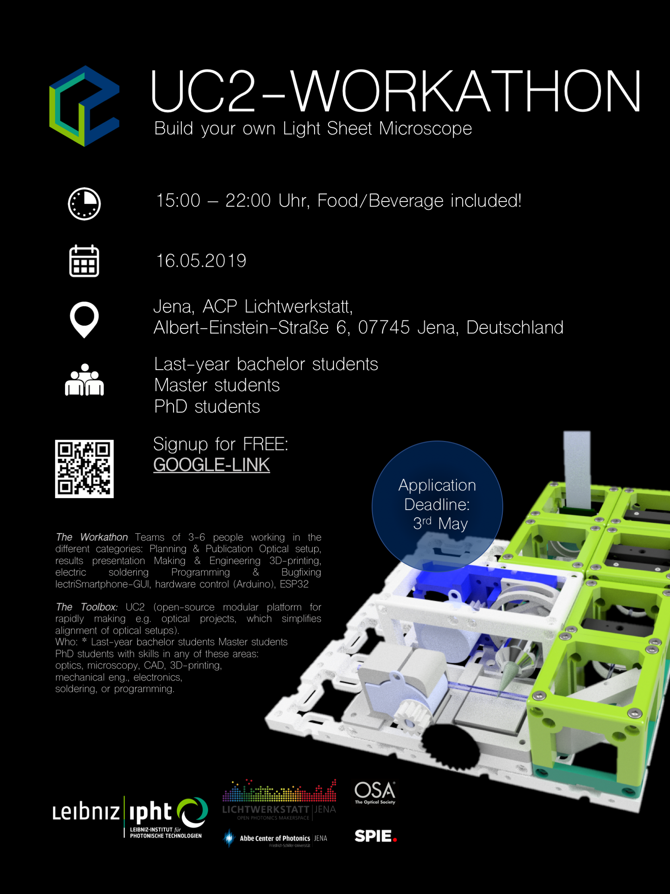

## Light-Sheet WORKSHOPs 
We have a [ready-to-use documentation as a PDF](UC2_WORKSHOP_Lightsheet_Microscope_v0_english.pdf) which will be updated over time. Please find it [here](UC2_WORKSHOP_Lightsheet_Microscope_v0_english.pdf). An assembly tutorial with photos for each module can be found in the folder [CAD](/CAD). 

<href = "UC2_WORKSHOP_Lightsheet_Microscope_v0_english.pdf">

### The final Setup

### Workshop
The workshop took place at the Lichtwerkstatt Jena on the international Day of light 2019 together with the OSA&SPIE student chapters, as well as the IPHT Leibniz Institut Jena. 

https://github.com/bionanoimaging/UC2-GIT/tree/master/WORKSHOP/LIGHTSHEET
