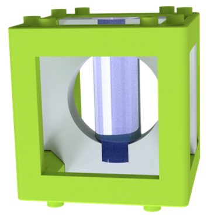
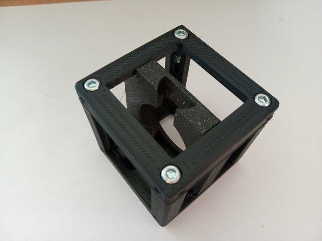
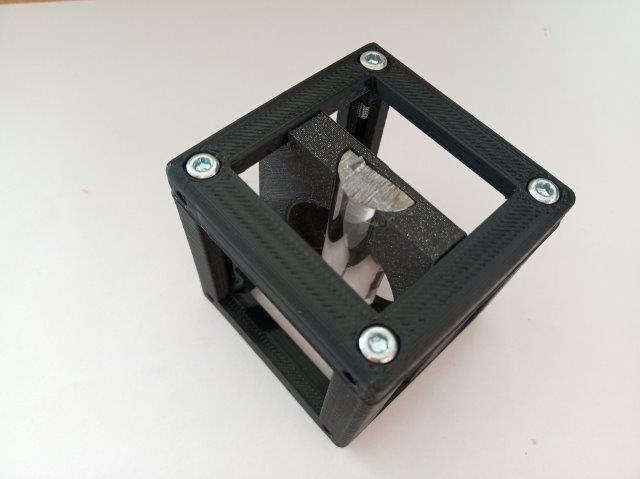
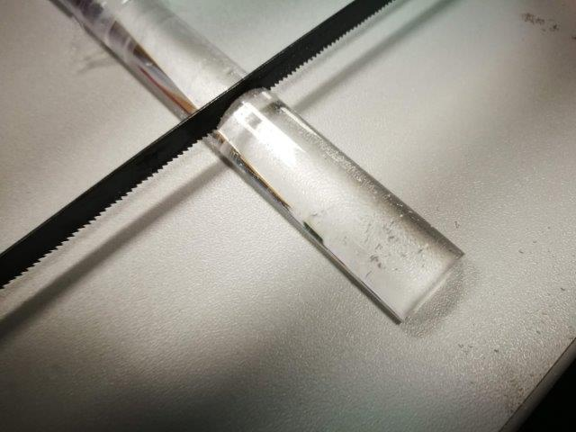

# Cylindrical Lens holder Cube
This is a lens-holder for rectangular (e.g. cylindrical) lenses.

The STLs and links for buying parts are only provided in [APP_LIGHTSHEET_Workshop](../APP_LIGHTSHEET_Workshop) to avoid confusion.

## Purpose
It adapts a half of a plexiglass rod to the UC2 system. The focal length is short and the general performance is of course not as good as with a glass lens, but it is a truly home made cylindrical lens and it just works.

### Cylindrical lens (in the light sheet)
Like any other lens, a cylindrical lens focuses the incoming light. In case of a positive focal length, the focal spot can be found right after the lens inside the back focal plane (BFP), usually measured as the focal length of the lens. In case of a cylindrical lens, the focus spot is not a single point as in a rotationally symmetric lens, but rather a line like focus. This is because an incoming parallel beam gets focussed only in one direction. In the eye this sometimes happens and hinders clear eyesight by introducing astigmatism (greek: point-less)

More information:

* [What are cylindrical lenses?](https://www.edmundoptics.com/resources/application-notes/optics/what-are-cylinder-lenses/)
* Comar Optics, 63 YE 25, cylindrical lens 63, coated

### Properties
* design is derived from the base-cube
* the adapter can hold a rectangular lens

## Parts
The [Bill of Materials](https://docs.google.com/spreadsheets/d/1U1MndGKRCs0LKE5W8VGreCv9DJbQVQv7O6kgLlB6ZmE/edit?usp=sharing) is always the most up-to-date version!

###  3D printing parts
* No support needed in all designs
* Carefully remove all support structures (if applicable)

The Cube consists of the following components.

* **The Lid** where the Arduino + Electronics finds its place ([LID])
* **The Cube** which will be screwed to the Lid. Here all the functions (i.e. Mirrors, LED's etc.) find their place ([BASE])
* **The Lens Holder** which holds a plexiglass rod (half) ([HOLDER])

###  Additional parts
* Plexiglass rod - half

##  Assembly
* Add the insert to the Cube
* Close the cube
* Put the lens inside the insert
* Done!

### Tutorial with images (Plexiglass rod)
1. All parts for this model

2. Put the insert inside the cube

3. Close the cube

4. Insert the lens into the insert. You can fix it using some tape to keep it safe.

Note: How to get a pice with the right length? Be creative ;-) But also careful!

## Safety
Don't touch the lens' surfaces!
