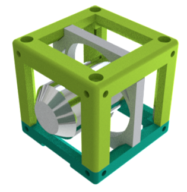

# Generic Lens Holder Cube
This is the repository for the Generic Lens Holder Cube.

The STLs and links for buying parts are only provided in [APP_LIGHTSHEET_Workshop](../APP_LIGHTSHEET_Workshop) to avoid confusion.

## Purpose
Spiral holder: It adapts any circular symmetric lens with varying diameter to the UC2 system.

### Properties
* design is derived from the base-cube
* the adapter can hold a large variety of different lenses (different diameter/thickness)
* Spiral holder: the spiral automatically centers the lens to the optical axis

## Parts

###  3D printing parts
The Part consists of the following components.

* No support needed in all designs
* Carefully remove all support structures (if applicable)

* **The Lid** where the Arduino + Electronics finds its place ([LID])
* **The Cube** which will be screwed to the Lid. Here all the functions (i.e. Mirrors, LED's etc.) find their place ([BASE])
* **The Objective/Lens Holder** which holds a lens with varying diameter and adapts it to the base cube ([HOLDER])

###  Additional parts
* 8× DIN912 M3×12 screws (galvanized steel)
* alternatively: 4× M3×12 and 4× M3×8
* Microscope Objective lens (spiral holder) 

##  Assembly of the Spiral Lens Holder
* Mount the lens inside the insert
* Put the Insert inside the Cube
* Add all screws to the Cube
* Done!

### Tutorial with images (Spiral Lens Holder)

1. All parts for this model

1. Put the lens inside the Spiral lens adapter (it auto centers)

1. Insert the insert into the Cube, add screws - Done!

## Safety
Don't touch the optical surfaces - fingerprints and scratches are bad for lenses!
