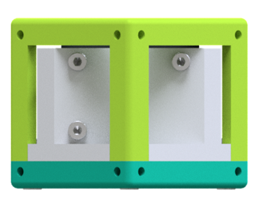
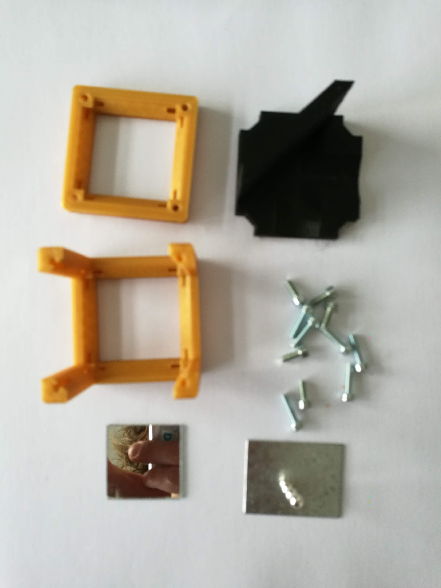
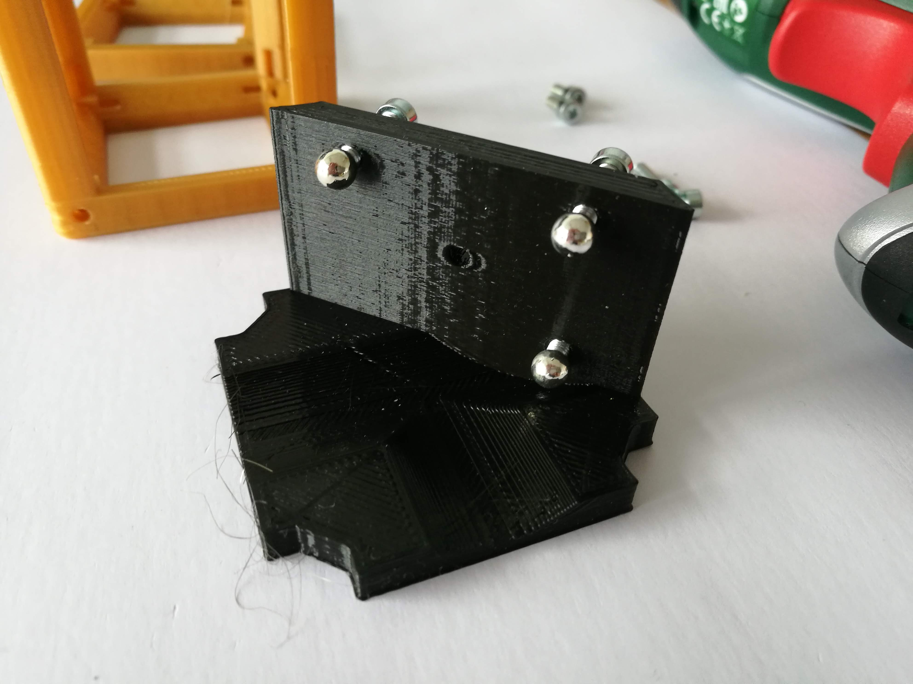
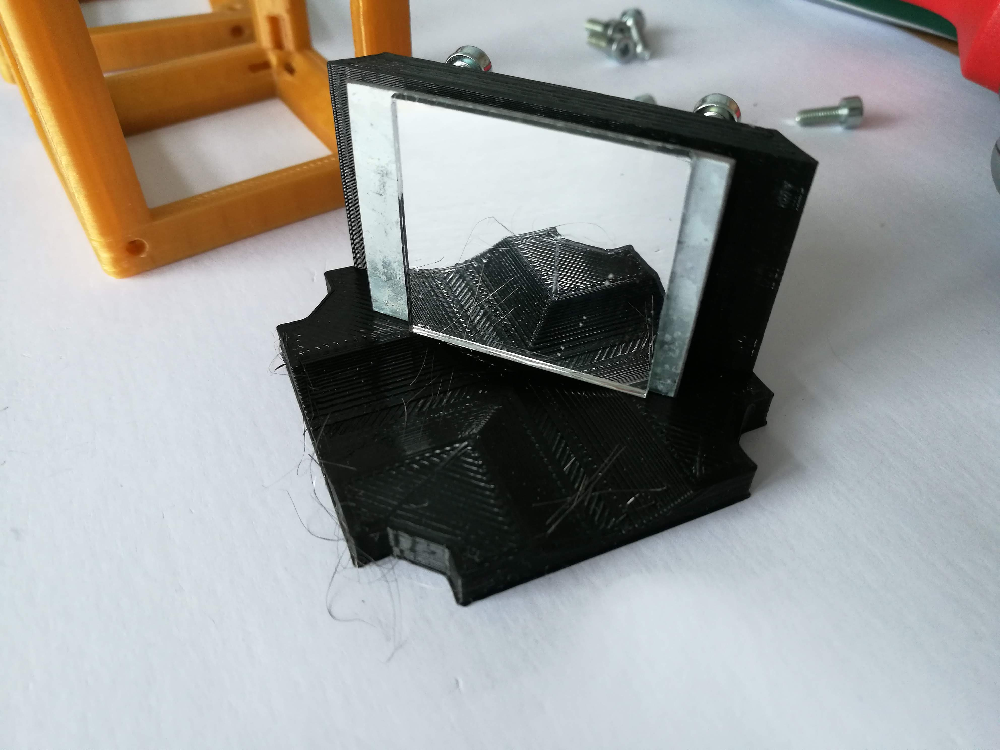
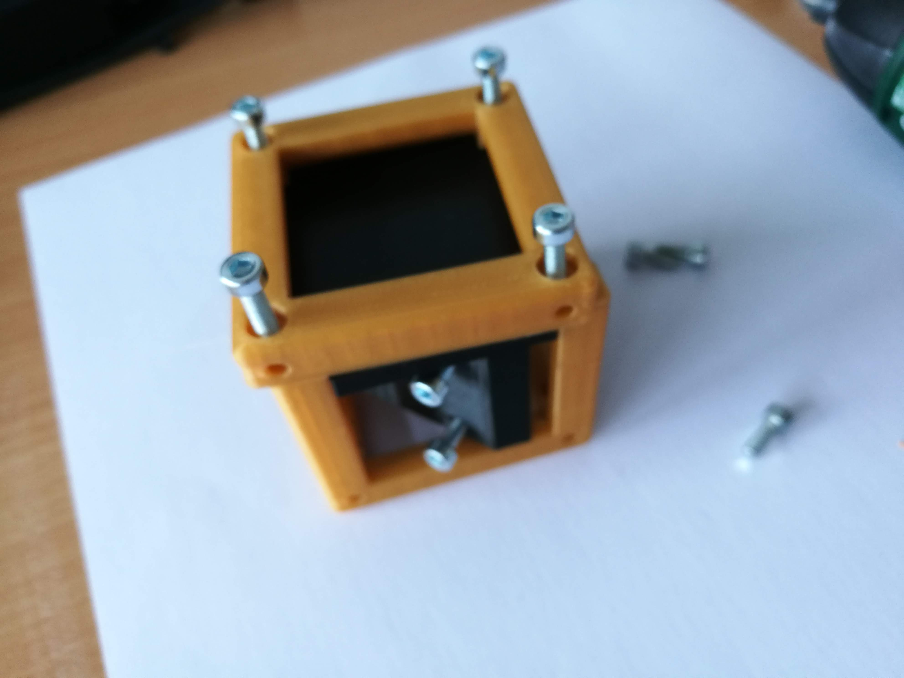
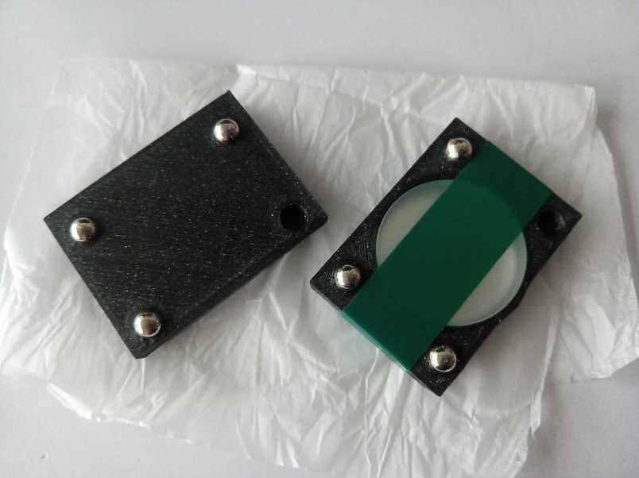

# Kinematic Mirror Holder Cube - Diagonal
This is the repository for the Diagonal Kinematic Mirror Holder Cube.

The STLs and links for buying parts are only provided in [APP_LIGHTSHEET_Workshop](../APP_LIGHTSHEET_Workshop) to avoid confusion.

## Purpose
It adapts a mirror to the UC2 system. It allows precise tilting in *x* and *y*.

Due to limited space, we sometimes need to fold the beam using a mirror. This is done by reflecting the incoming light under an angle of 45°. It follows in a change of the optical axis by 90°.

### Properties
* design is derived from the base-cube

## Parts

###  3D printing parts
* No support needed in all designs
* Carefully remove all support structures (if applicable)

The Cube consists of the following components.

* **The Lid** where the Arduino + Electronics finds its place ([LID])
* **The Cube** which will be screwed to the Lid. Here all the functions (i.e. Mirrors, LED's etc.) find their place ([BASE])
* **The Kinematic Mirror Holder Base** which holds the three screws that change the tilt of the mirror ([INSERT])
* **The Mirror Holder for the Kinematic Mirror Holder** which holds the Mirror on the front side and three magnets on the back. For 30×30mm² Toy mirror ([SQUARE MIRROR HOLDER])

###  Additional parts
* 11× DIN912 M3×12 screws (galvanized steel)
* 3× Ballmagnets, arbitrary diameter
* 1× Mirror (e.g. Amazon 30×30mm² with double-sided sticky tape)

##  Assembly
* Remove any support and clean the part
* Insert three M3 screw into the holes in the mirror holder. There are four holes - the one in the center of the part stays empty! Make sure you are using the correct holes
* Slide the mirror holder into the Cube
* Add the lid and fix it using a set of M3 screws
* Insert the ballmagnets into the mirror holder.
* Glue/Insert your mirror to the holder. For the sticky mirror: place the mirror roughly in the center of the plate
* Attach the mirror holder to the ends of the screws of the kinematic mirror base using the magnets of the mirror holder and the screws of the base
* Done!

### Tutorial with images
**Note:  
The previous version of this module used a metal plate instead of the 3D printed plate. We got rid of the metal plates, since they are not generally available. Other than the, the assembly is still the same - have a look in step 8.  
The metal plates limit the play between the magnets and screws, so it might be a more stable solution. However, they are not generally available components (We had them custom cut in a mechanical workshop).**

1. All parts for this model

1. Add M3 screws to the insert

1. Add Ballmagnets to the screws

1. Add the magnetic plate to the Ballmagnets

1. Glue the mirror onto the magnetic plate

1. Put the insert in the cube

1. Add the M3 Screws - Done.

1. Here you see the 3D printed plates for the toy mirror and for 1" mirror. Simply press the ballmagnets into the holes of the plate using pliers.

1. In the end it should look like this:  

## Safety
Don't touch the mirror surface!
