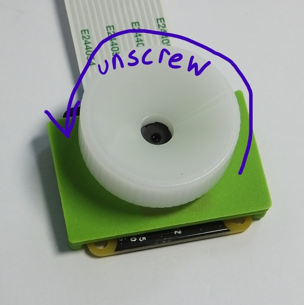

# Camera Cube
This is the repository for the Camera Cube.

The STLs and links for buying parts are only provided in [APP_LIGHTSHEET_Workshop](../APP_LIGHTSHEET_Workshop) to avoid confusion.

## Purpose
It adapts a standard Raspberry Pi Camera (v1, v2) to the UC2 system.

The sensor (w/wo lens) is put into an adapter which holds the camera in the center of the cube. The height can be varied by sliding the adapter along the slides. It is designed to eventually hold (fluorescent) filters. The camera need to be fixed with a set of screws. M2x10mm in combination with nuts work best.

### Properties
* design is derived from the base-cube
* camera adapter can be adjusted to individual needs

## Parts

###  3D printing parts
* No support needed in all designs
* Carefully remove all support structures (if applicable)

The Cube consists of the following components.

* **The Lid** where the Arduino + Electronics finds its place ([LID])
* **The Cube** which will be screwed to the Lid. Here all the functions (i.e. Mirrors, LED's etc.) find their place ([BASE])
* **The Camera Insert** which holds the camera and makes it adaptable to the base-cube ([INSERTE])

###  Additional parts
* 8× DIN912 M3×12 screws (galvanized steel)
* 1× Raspi Camera (v1, v2)
* 1× long cable for Raspi Camera
* 2× M2*10 screws (best: plastic)
* 2× M2 nuts (best: plastic)

##  Assembly
* Mount the flex cable to the raspi-cam
* Mount the camera board to the Camera-Inlet using the 2 M2 screws
* Fix the position by mounting the 2 nuts. Take care to not destroy the camera'S PCB
* Take the mounted camera adapter inlet and slide it into the base-cube
* Take the cube lid and mount it using the 4 hex screws
* Done!

## Remove the lens from the camera
The Raspberry Pi camera has a tiny lens and you will need to remove it for the experiments. Do this before you mount the camera to the insert. Be careful not to damage the camera chip.

The picture and the instruction are taken from the nice tutorial of the [openflexure microscope](https://build.openflexure.org/openflexure-microscope/v6.1.5/docs/#/2a_basic_optics_module?id=step-5). 

Unscrew the lens from the camera module. Use the plastic tool to grip the lens module. This is a small circular part with four prongs that fits over the lens of the camera board (version 2 only) as shown. To remove the lens, push the removal tool onto the lens (just the top part, with the little plastic flanges) and turn anticlockwise to remove it.

Once you've removed the lens, be sure to place the camera face down on the desk, or put a piece of tape over the square black lens holder; this will help stop dust settling on the sensor, which is extremely hard to clean.

### Tutorial with images

1. All parts for this model

2. Remove the Lens of the raspberry pi camera using the tool which comes with it. Optional: Add a longer camera cable to it.

3. Add the camera to the insert using some M2 crews + nuts. Be careful and try not to destroy the camera! It's fragile.

4. Add the screws - Done!

## Safety
Be careful with the camera's PCB. It's sensible to electronic static discharge!
