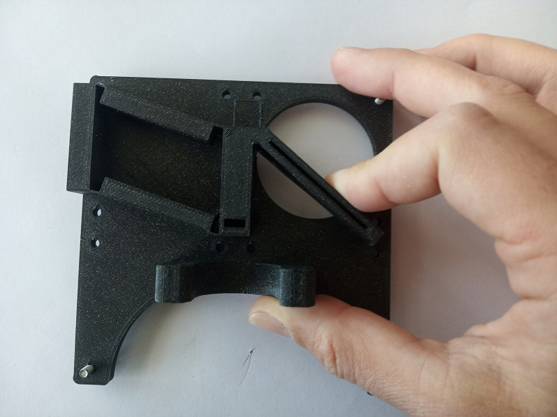
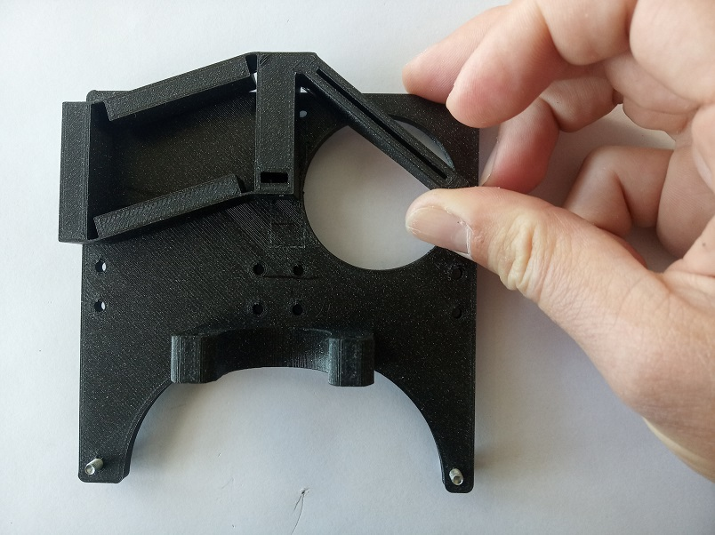
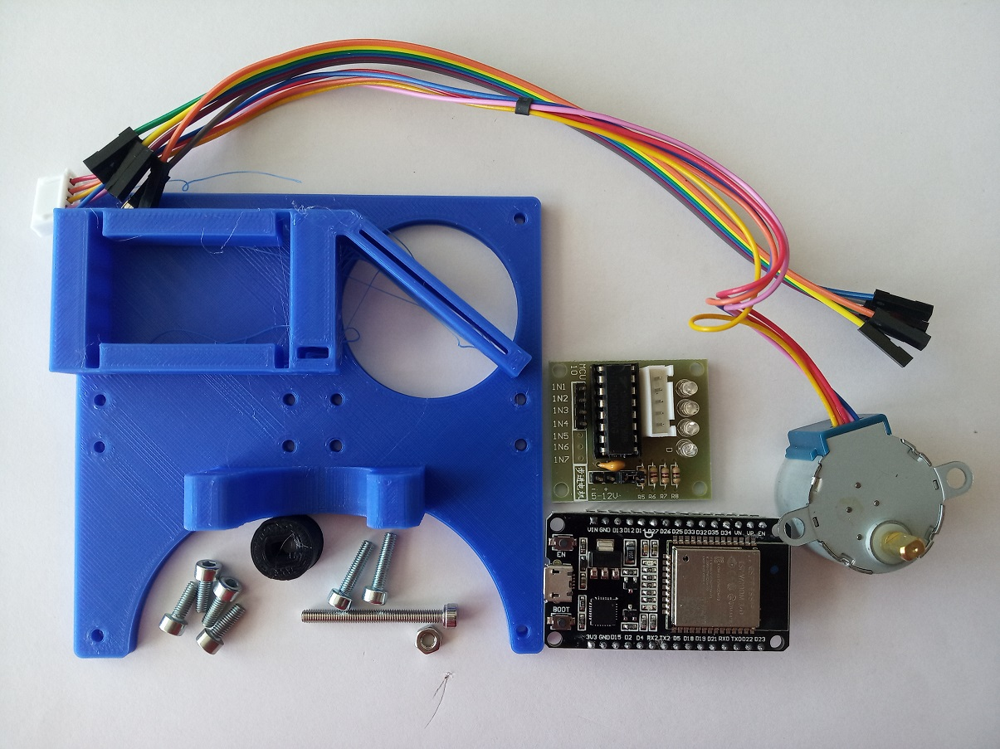
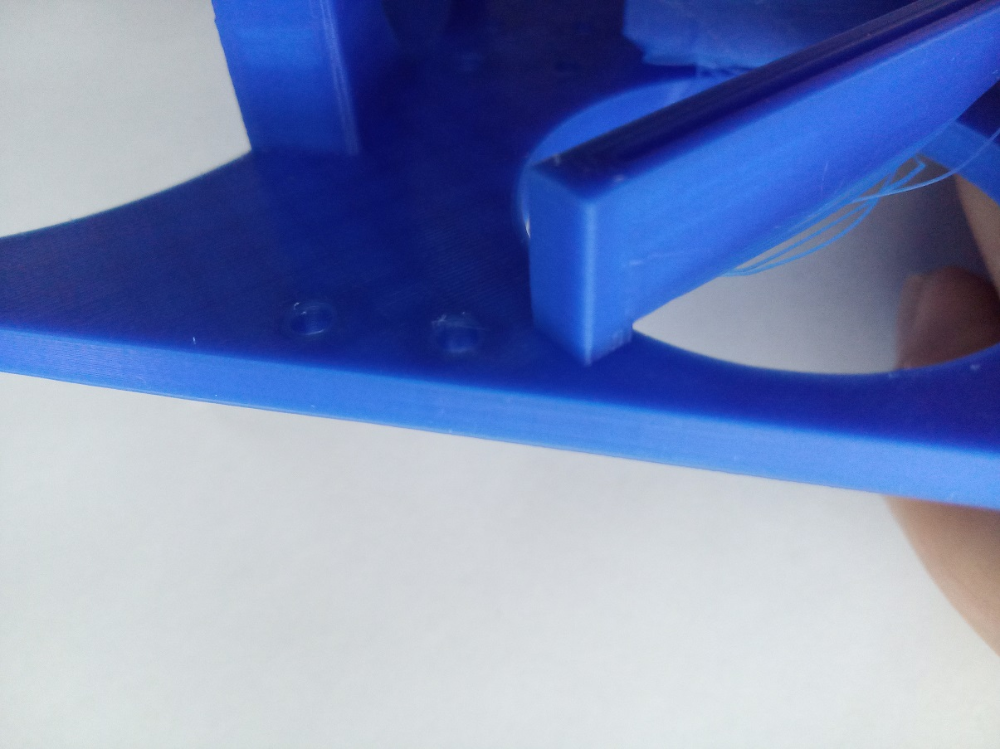
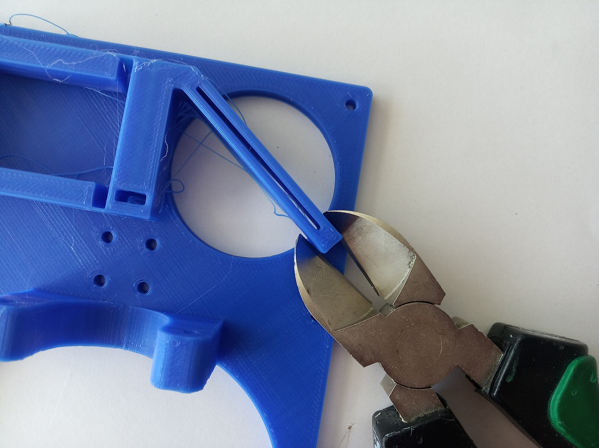
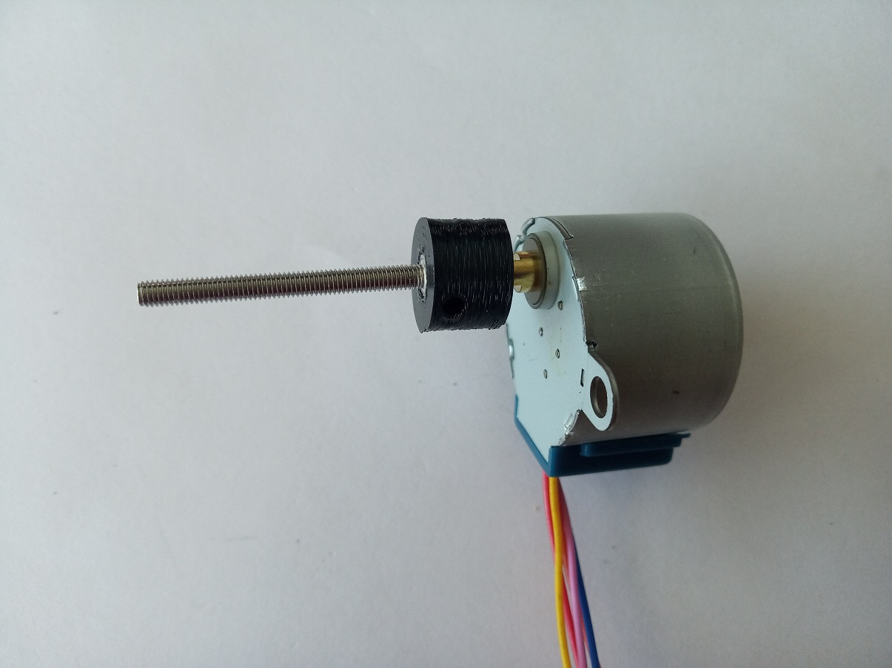
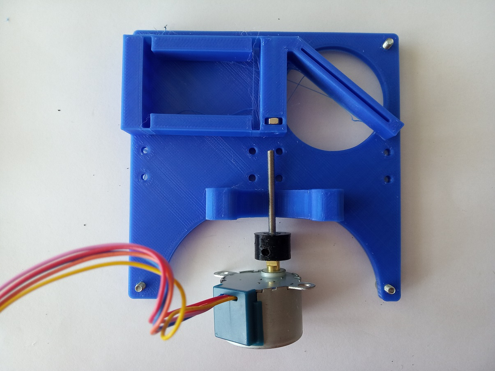
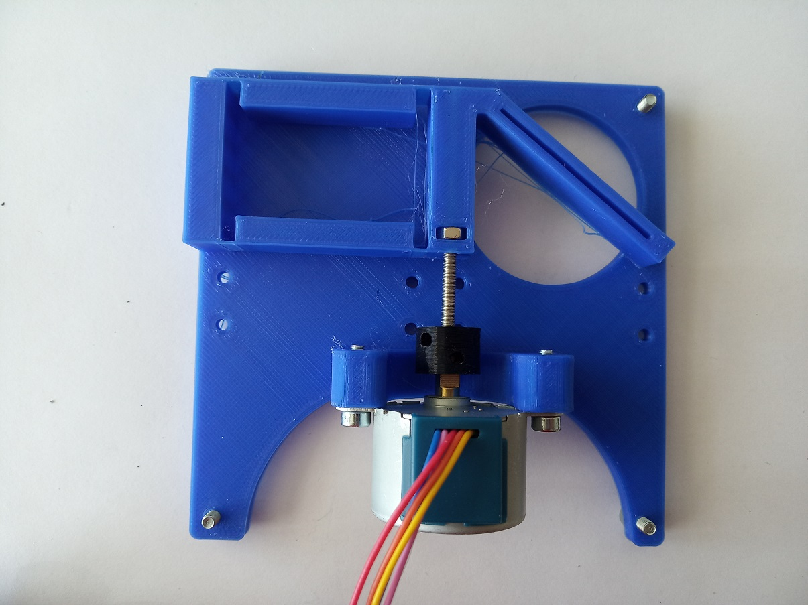
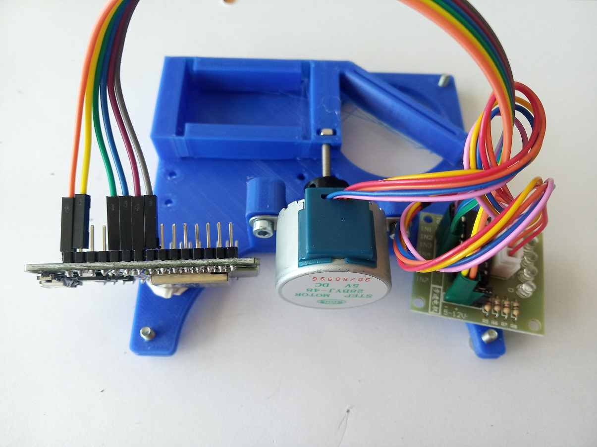

# Sample-Stage for light sheet microscope
This is the repository for the Z-Stage (Sample) that is used in the light sheet microscope.

The STLs and links for buying parts are only provided in [APP_LIGHTSHEET_Workshop](../APP_LIGHTSHEET_Workshop) to avoid confusion.

Note: The wiring and electronics is the same as in the previous version, just the 3D printed stage is different.

### Purpose
In light sheet microscopy one often needs the ability to move the sample trough the illuminating light sheet in order to capture the 3D information from the sample. This can either be done by scanning the light-sheet and focussing the objective lens simultaneously or by simply moving the sample along the optical axis w.r.t. the detection objective lens.

To keep the setup as simple as possible we decided to mount the sample on a slide to a stage which linearly moves it back and forth. Therefore, the light sheet and objective lens once aligned can always stay in the same position.

<p align="center">

</p>

**The mechanism is the following:**  
A stepper motor (28-BYJ) is attached to a screw that moves directly with the motor. On the screw, there is a nut which acts as a worm-drive. The conversion of the rotational into linear movement pushes/pulls the arm of a linear flexure bearing mechanism. The slide is inserted in the slit at the end of the arm. For moving range around +/- 10 mm the movement is fully linear.
<p align="center">



</p>

## Properties
* theoretically no play due to the use of flexure bearings
* moving range around +/- 10 mm
* very low cost by relying on off-the-shelf components

## Parts

###  3D printing parts
* No support needed in all designs
* **Carefully remove the in-built support structure as shown in the assembly tutorial - step 2**

The Model consists of the following components.

* **The Sample stage for light sheet microscope** where the motor is mounted and the sample is held ([STAGE])
* **The Coupling Screw** which couples the motor to a screw a through that to the movement of the stage ([SCREW])


###  Additional parts
* 6× DIN912 M3×12 screws (galvanized steel)
* 1× M3 Nut
* 1× M3 Screw, 30 mm
* 1× 28-BYJ stepper motor with 1x Driving electronic
* 1× ESP32 for controlling the motor
* wires to connect everything; for example: 6× Female-Female Jumper Wire, 0.14 mm²
* 1× USB Micro Cable 

##  Assembly
* Remove the support material
* Add screws to the basis of the stage
* Connect the motor to the M3×30 screw via the Coupling Screw
* Add the M3 nut in the dedicated hole close to the moving stage
* Mount the motor to the stage
* Wire the motor, test it
* Done!

### Tutorial with images

1. All parts for the module
<p align="center">

</p>

1. The sample stage is designed with a little support structure to ensure successful printing. A single layer wall connects the arm that carries the sample to the basis of the stage. This support needs to be carefully removed. Using pliers, cut the support material. After this, the stage mechanism can be moved freely. If there's some leftover of the support, remove it with the pliers as well.
<p align="center">



</p>

1. Insert four M3×12 (or M3×8) screws from the bottom side of the stage into the holes in the corners. Tighten them completely. Later, when working with this module, you can adjust the height by loosening the screws.
<p align="center">


</p>

1. Insert the M3×30 screw into the coupling screw using pliers.
<p align="center">


</p>

1. Connect the coupling screw to the motor.
<p align="center">


</p>

1. Insert the M3 nut into the stage. Depending on the shrinkage of the material (depending on the 3D printer used) it might be difficult to get the nut inside or the hole might be too loose. Place the nut roughly in such a position that you can screw the screw thought it. It will adjust its position when the screw is added.
<p align="center">


</p>

1. Screw the M3×30 screw into the nut and the hole in the stage. Screw it in until the motor reaches its bed.
<p align="center">


</p>

1. The motor must be turned cables up and touching its bed. Fix it using two M3×12 screws. Do not overtighen the screws! That creates tension in the motor.
<p align="center">


</p>

1. Finished mechanical assembly:
<p align="center">

</p>

1. Connect all the electronics following the instructions in [Z-Stage](../Z-Stage). Upload the respective code from [here](../ESP32). Done!
<p align="center">

</p>


## Electronics
In general we could use any of the output pins of the ESP32, but for the Sample-Stage we typically use the following:

```
Motor02  = 25, 26, 27, 14
```
They connect to the `IN1, IN2, IN3, IN4` of the motor controller respectively. Find the details in the [Z-Stage](../Z-Stage) section.

## Safety
Be careful!
