# Z-Stage (Objective) Cube
This is the repository for the Z-Stage (Objective) Cube.

The STLs and links for buying parts are only provided in [APP_LIGHTSHEET_Workshop](../APP_LIGHTSHEET_Workshop) to avoid confusion.

## Purpose
In microscopy one often needs the ability to move the objective along the optical axis in order to refocus a given 3D sample.
In order to automate this, we designed a very simple z-stage itself relying on flexure bearings also known from Bowman's flexurescope.

**The mechanism is the following:**

**Course movement:** The objective is mounted on a ring which has a screw on one side and the screw head is inserted in a slot in the focussing insert. The movement range for this is 35 mm - the full length of th slot.

**Fine movement:** For fine focussing the linearbearing lever is moved by (in this case) a step-motor. When the screw pushes or pulls the lever, due to a rotation of the motor, the objective mount moves with it.

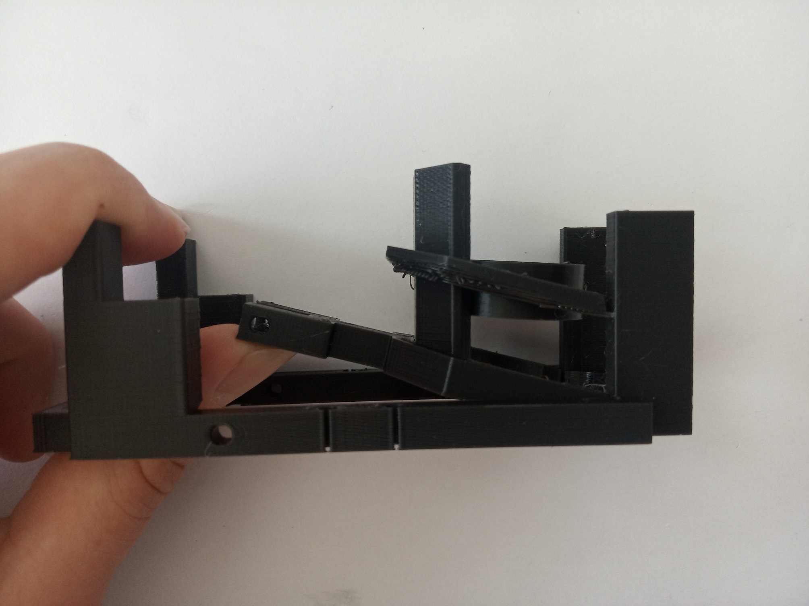

### Properties
* theoretically no play due to the use of flexure bearings
* moving range
	* fine: around +/- 6 mm
	* coarse: around 30 mm (shifting the objective lens inside the slot)
* very low cost by relying on off-the-shelf components

## Parts

###  3D printing parts
* No support needed in all designs
* Carefully remove all support structures (if applicable)

The Cube consists of the following components.

* **The Lid (2x1)** where the Arduino + Electronics finds its place ([LID])
* **The Cube (2x1)** which will be screwed to the Lid. Here all the functions (i.e. Mirrors, LED's etc.) find their place ([BASE])
* **The Z-Stage and Motor Holder** which moves the objective and holds the stepper motor ([INSERT])
* **The M3 to Motor Adapter (mech. Coupling)** which connects the Motor directly to an M3 screw which acts as a wormdrive ([SCREW])
* **The Objective Lens Mount** which holds the objective and allows for coarse movement ([OBJECTIVE MOUNT])

For Fluomodule:
* **The Fluomodule** where the LEDs finds their place ([FLUOMODULE])
* **The Adapterplate** which goes on top and where the slides are placed ([ADAPTERPLATE])
* **The Clamp for microscope slides** which can fix the slide ([CLAMP])

###  Additional parts
* 10× - 20× DIN912 M3×12 screws (galvanized steel)
* 3× DIN912 M3×8 screws (galvanized steel)
* 2× DIN912 M3×18 screws (galvanized steel)
* 1× M3 Nut
* 1× M3 Screw, 30 mm or longer (non-magnetic)
* 1× 28-BYJ stepper motor with 1x Driving electronic
* 1× ESP32 for controlling the motor
* wires to connect everything; for example: 6× Female-Female Jumper Wire, 0.14 mm²
* 1× USB Micro Cable

For fluomodule:
* 2× LED
* PNP-transistor BD809
* 4× DIN912 M3×18 screws (non stainless steel)
* 4× ballmagnets, 5 mm diameter
* wires to connect everything

##  Assembly

### Tutorial with images (Z-Stage)
This is the assembly guide for the Z-Stage.

1. All parts for this model. The electronics comes later.

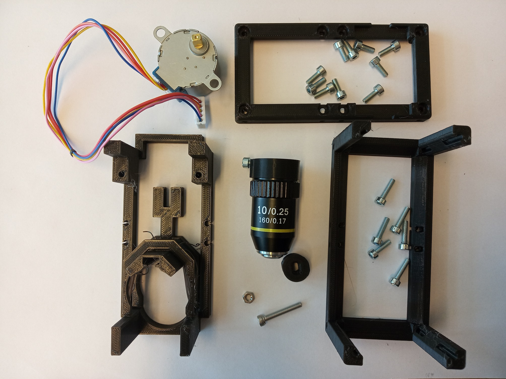

2. Insert the motor into the motor-screw-coupling adapter.

3. Insert the head of the M3×20 screw into the motor-screw-coupling adapter. Use pliers to press the screw inside.

4.  Fix the head of the M3 screw inside the adapter using two M3 worm screws (This can also be done later, in case the screw becomes too wobbly.) You may fix the motor-end the same way, if needed.

5.  The M3 nut goes into the level of the Z-stage.

6. We will fix the nut inside the lever using two M3×8 screw. Firstly, insert one screw but only enough to not fall out for now. Use a hex key through the hole in the side of the Z-stage to tighten this screw.

7. Add the screw to the opposite side. The screws must not hold the nut inside yet! Make sure the screws are tight enough not to fall out and then remove the nut.

8. Screw the M3 nut on the M3×20 screw, which is attached to the motor. The optimal position for the nut is roughly one third of the length of the screw from the couling adapter.

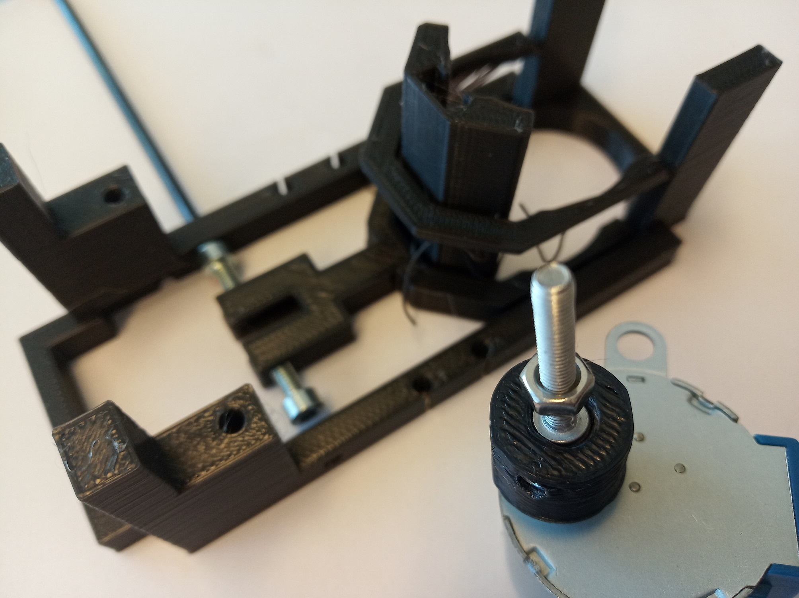

9. Insert the nut back to the lever, using the motor with the screwto hold it easily. The wire end of the motor is pointing away from the objective side of the Z-stage. Tighten the two M3×8 screw to fix the nut - the nut must not be able to rotate.

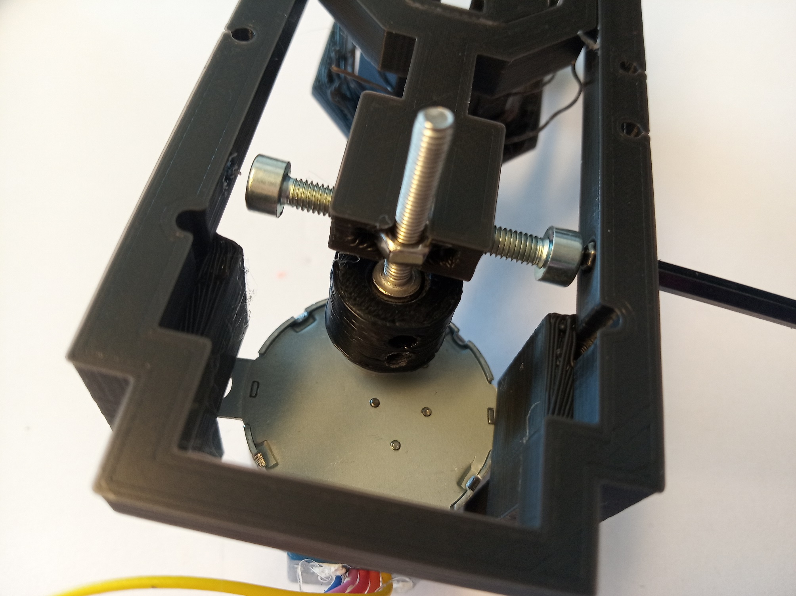

10. This is how it should look like. The M3×8 screw should be tightened equally. Do not overtighten the screws - you might break the part.

11. Using two M3×8 screws, fix the motor to the Z-stage.

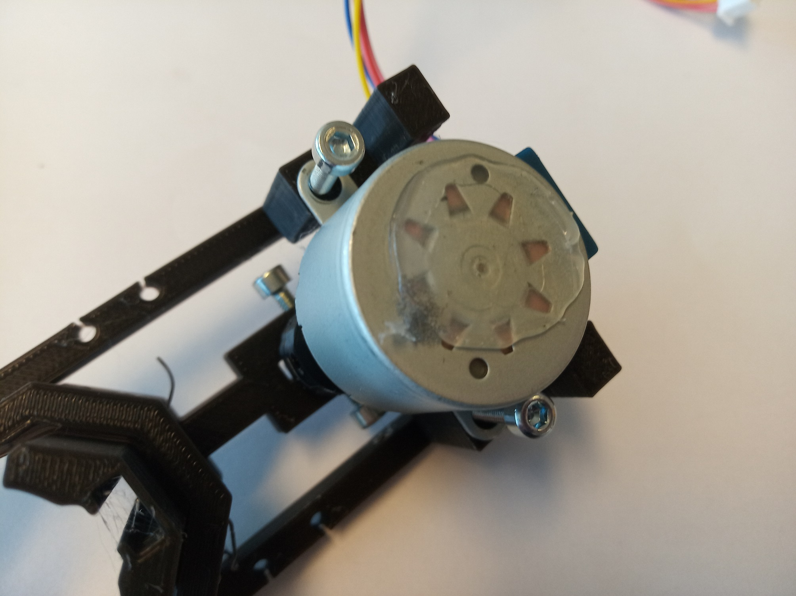

12. This is how it should look like now.

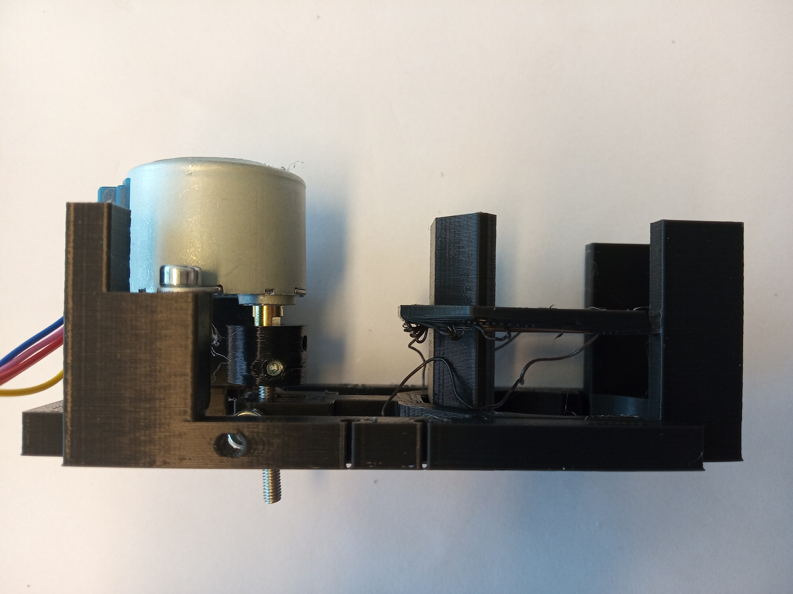

13. Insert a M3×8 screw in the objective mount as shown in the picture. Don't screw it all the way in but leave roughly 1 mm between the head of the screw and the flat side of the objective mount.

14. Insert the objective lens into its mount.

15. Insert the objective mount into the focussing insert. The head of the M3×8 screw goes into the slot in the insert. In case the screw is too tigten to the objective mount, it won't go into the slot - loosen the screw a little. In case the head of the screw is too far from the objective mount, it won't hold in the slot but fall through - tigten the screw a little.

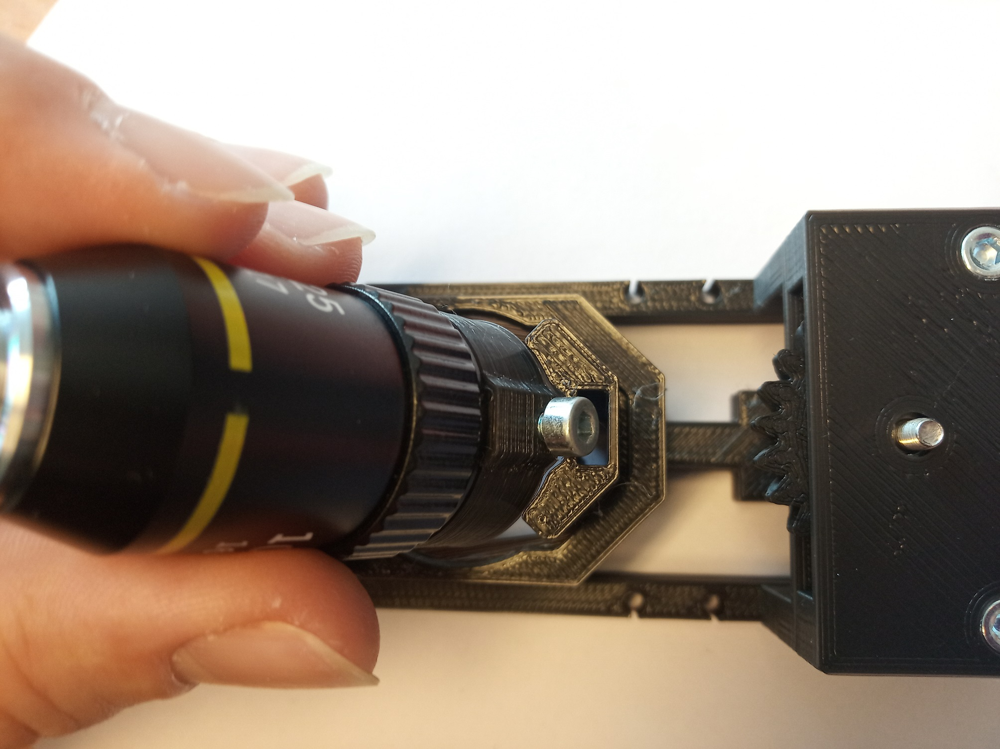

16. The optimal case: the objective mount holds the objective in any position within the slot. You should be able to shift the objective but it shouldn not move on its own. Adjust the screw of the objective mount if necessary. The assembled insert looks like this:

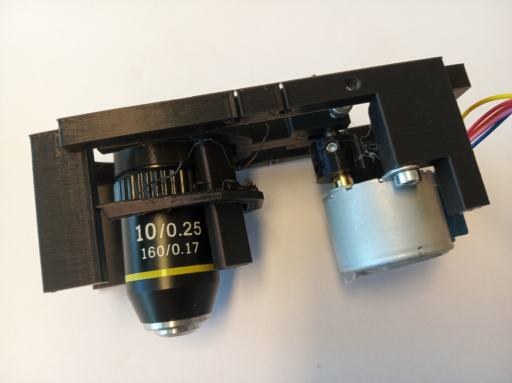

17. Place the insert inside the cube. For optimal use, the lid of the cube should be sideways from the insert, as shown in the picture. Close the cube using four M3×12 screws.

18. Add as many M3×8 screws as possible to both the lid and the bottom of the cube-body. *Note: It might seem that the cube is too small and the motor doesn't have enough space. You can just file the edge of the cube a little, to make it fit better.*

19. Time for the electronics: You will need the parts shown in this picture.

20. Connect all cables to the ESP32 following the [Z-Stage instructions](../Z-Stage) in the Electronics section. The ESP32 will go on the side of the Z-stage and all the cables will go through the cube.

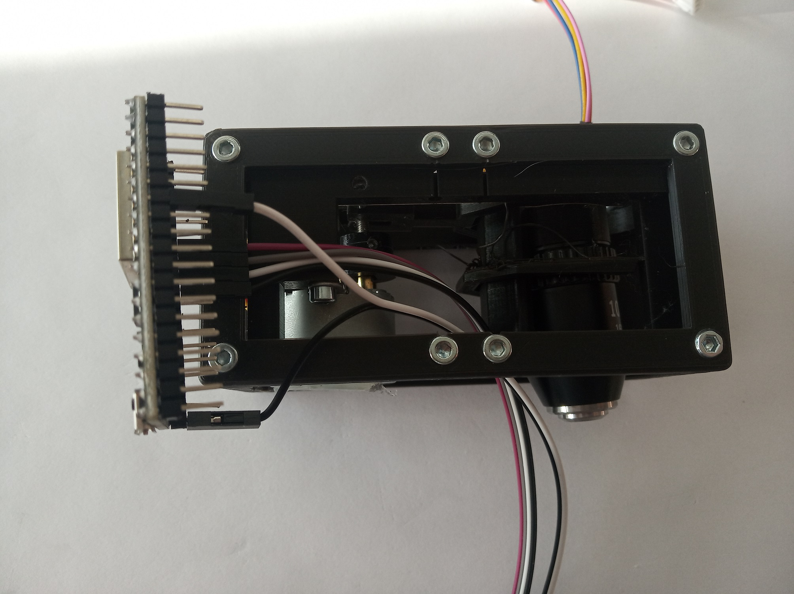

21. Place the ESP32 in the cube as shown in the picture. It needs to be on this side with respect to the objective and motor - this way the power cable won't be in the way in any of the setups where you might use the Z-stage.

22. Gently pull all the cables - both from ESP32 and stepper motor - through the cube and out on the side opposite to where the objective is looking.

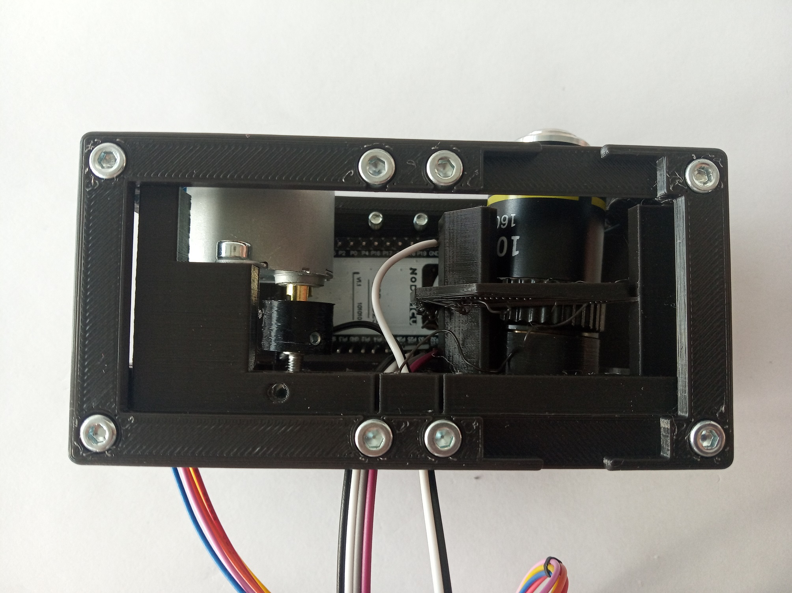

23. Place the driver board of the motor on the objective side of the cube.  

24. Gently glue or screw the driver board to the insert.

25. Connect all the cables of the ESP and the motor to the driver board ([Z-Stage](../Z-Stage)).

26. Gently fix the ESP32 to the cube - Done!

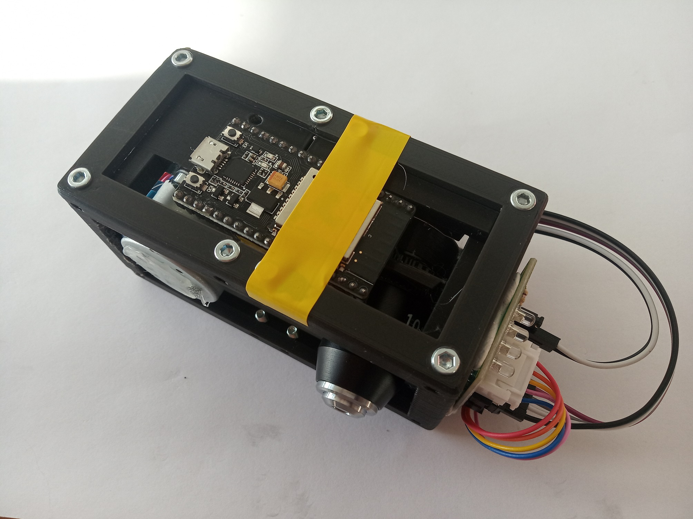

27. This is the correct mutual position of the Z-stage insert, objective, motor, ESP32, motor controller and all the wires.

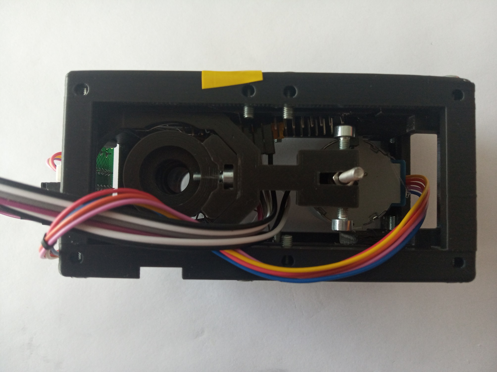

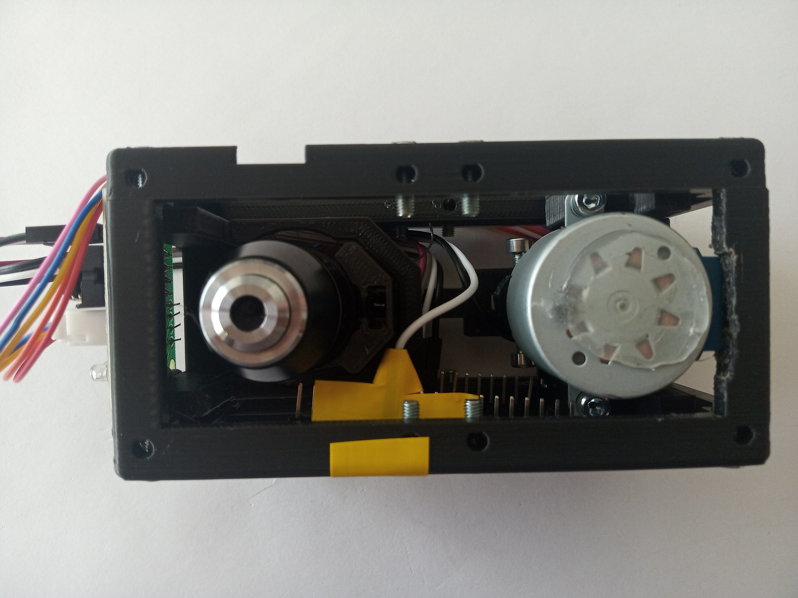

28. Upload the respective code from [here](../ESP32). Done! Do not plug anything in the power supply, unless you are sure everything is correctly connected.

## Safety
Be careful!
