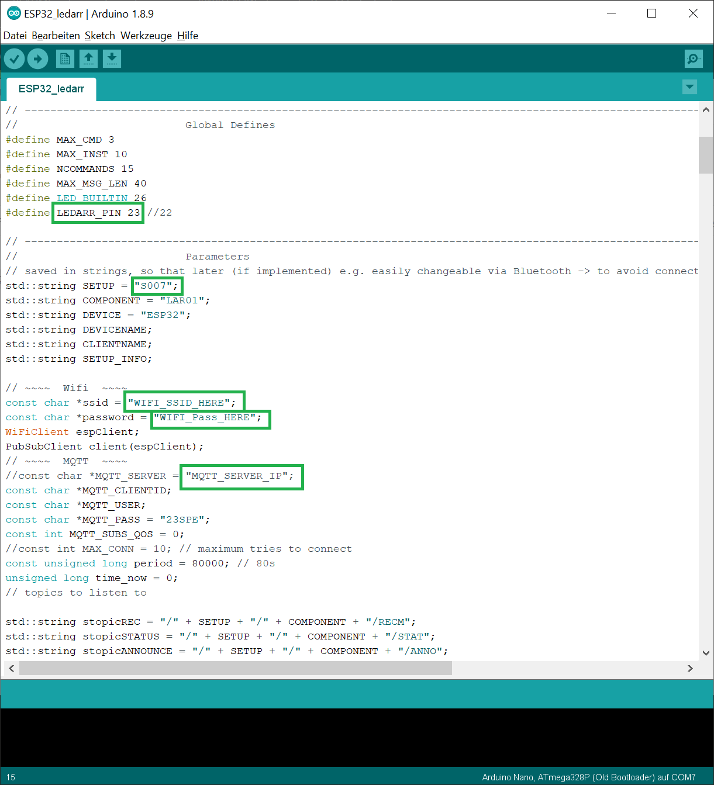
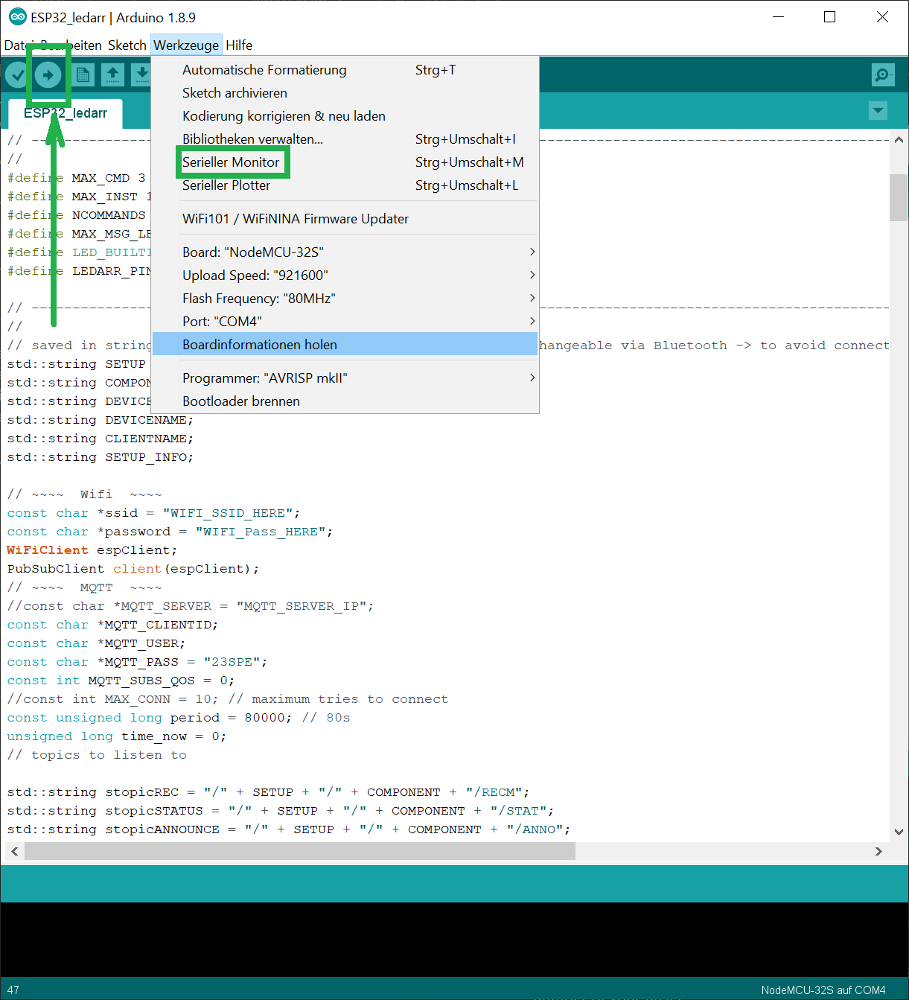

# How to Connect the ESP32 with the GUI
Find more files about this in the subfolders.
*   [LED-array](./ESP32_ledarr)
*   [minimal LED-array ](./ESP32_ledarr_minimal_with_Button) (minimal working example together with a button)
*   [MOTOR and Fluorescence (all-in-one) module](./ESP32_motor_fluo)

# Setting up the LED-array with MQTT
## Prepare the Script
Download the whole folder if you are using VSCode + PlatformIO. If you are using ARDUINO-IDE and prepared it as [explained here](../README.md), then you only need to:
*   Create a new folder in your Arduino-folder called ̀`ESP32_ledarr`
*   Download the [Main.cpp](./ESP32_ledarr/src/main.cpp), rename it to: `ESP32_ledarr.ino` and copy it into the just created folder.
*   double click and wait for your IDE to open. It should look like this (after you scrolled slightly down):

Now you have to add some minor changes to:

*   Line 29 -> change the number behind `LEDARR_PIN` to the GPIO-PIN that you used to connect the LED-array with the ESP32
*   Line 34 -> change the number from `"S007"` to e.g. `"S001"` depending on the setup-number of your RasPi.
*   Line 42 -> enter the name of the WiFi-network here
*   Line 43 -> ... your Wifi-Password
*   Line 47 -> The IP of your Mosquitto (MQTT) host, hence e.g. your RasPi (depending on how you configured your system). In our case this was: `192.168.178.160`, but it can be totally different in your case.

Note: Always leave brackets or quotes where they are.

## Flash onto the ESP32
Now connect your ESP32 with your laptop. Depending on the board you bought, you have to select a different version under Tools in the IDE. In our case, we have a NodeMCU-32s connected and setup:

    

*   Press the "upload" button (as seen on the left in the image) to first compile and then flash the code onto the Raspberry.
*   **UPLOAD PROBLEMS?** If you see a pattern like "_____.....____" and nothing is happening, then hold the "BOOT" button on the ESP32 for a short while (3-5sec) and it should start to upload the code.
*   Monitor what is happening after you uploaded the code by starting the `Serial-Monitor` as boxed in the image before and change the BAUD-rate to 115200.
*   **MQTT CONNECTION NOT POSSIBLE?** Just restart the ESP32. You might have a particular button for this. If not, just unplug and plug in again. Now it should work.

# Setting up the MOTOR+Fluo module with MQTT
## Prepare the Script
Coming soon :)
