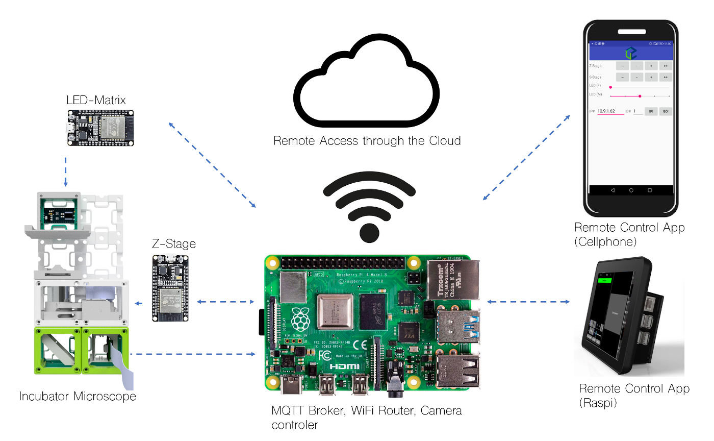
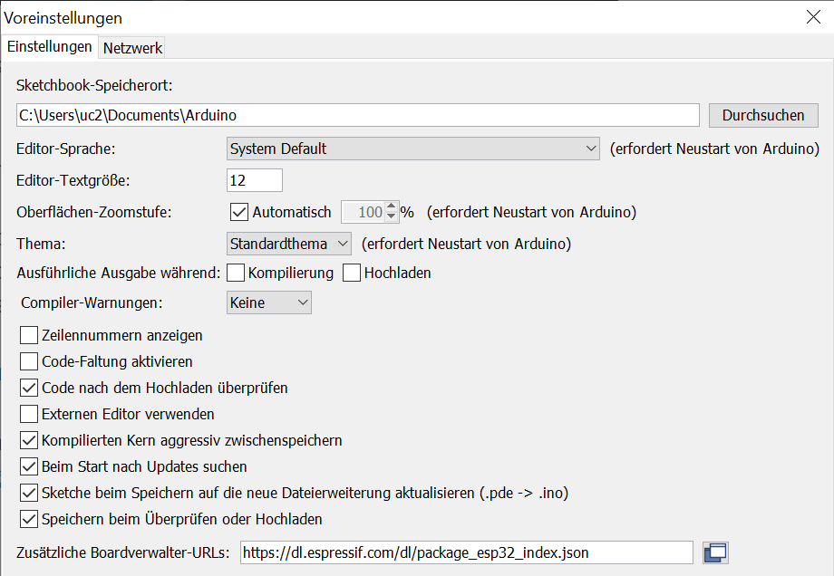
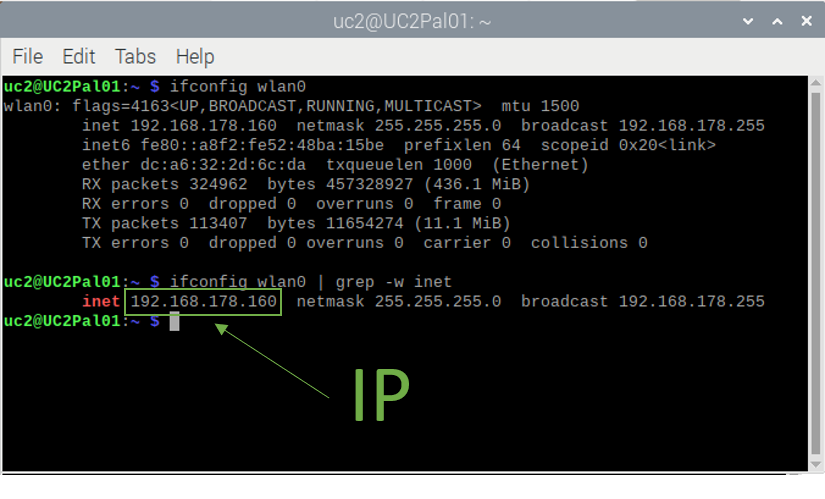

# ESP32
This is the Guide to explain how to use and control the ESP32 for controlling Motors or LEDs.  

<p align="center">

</p>

[MQTT](https://en.wikipedia.org/wiki/MQTT) is a subscription based broker-client system that works with topics and messages. In our environment the broker is typically running on the RasPi. Typical clients are Microcontrollers like the ESP32, Smartphones and the RasPi itself. A good introduction on the topic can be found on [Steves Guide](http://www.steves-internet-guide.com/mqtt/).

## Our tested ESP32 family
*   [ESP32 Wemos mini]()
*   [ESP32 nodeMCU]()
*   [ESP32 devKITv1]()

## Our MQTT-command scheme
We decided to make the topics and messages (=payloads) human-readable. Wildcards are possible as well. Our typically setup-environment is displayed in the image above and hence let's assume we use:
*   1x Raspi
*   1x ESP32 to control the LED-array
*   1x ESP32 to control the motors
*   1x Smartphone

Our environment is planned such that there is 1 RasPi that supervises at least 1 setup and hosts the MQTT-broker. 

### (1) Topics
Hence, the topic structure is: 
```
/<SETUP>/<DEVICE>/<GENERALCOMMAND>
```
We even standardized the lengths per Wordgroup, meaning: 
*   **SETUP** is of length 4 with 1 alphabetical and 3 numerical letters, eg **S001** for your first UC2 setup
*   **DEVICE** is of length 5 with 3 alphabetical and 2 numerical letters, eg **LAR01** for the first **L**ed-**AR**ray in your setup
*   **GENERALCOMMAND** is a general interface to communicate with whatsoever device via only 3 cmd options "ANNO", "RECM" and "STAT"

So a typical topic could look like this: 
```
/S007/LAR03/RECM
```
where the 3rd LED-Array in the 7th Setup listens to what you have to say. While the ESP32 typically subscribe as listeners to "RECM" they can post to "STAT" and "ANNO". For now, the latter two are deactivated. 

### (2) MESSAGES
The messages are typically a concatenation of ASCII alphanumerical characters that use a "+" sign as sequence seperators. Eg 
```
PXL+20+127+255+50
```
is a typical message that could be send to the above topic and would set the 20th Pixel to the RGB value [127,255,50].

### (3) Typical Commands: the LED-Array

For the LED device the typical commands are:

|COMMAND|RANGE|EXAMPLE|
|---|---|---|
|NA|UINT8 [0...4]|"NA+4"| 
|PXL|UINT8 [0...64,0...255,0...255,0...255] = [pixelNBR,R,G,B]|"PXL+20+127+255+50"|
|HLINE|UINT8 [0...8,0...8,0...8,0...8,0...255,0...255,0...255] = [x,y,w,h,R,G,B]|"HLINE+0+2+8+1+120+120+120" -> not active|
|VLINE|UINT8 [0...8,0...8,0...8,0...8,0...255,0...255,0...255] = [x,y,w,h,R,G,B]|"VLINE+0+2+8+1+10+10+90" -> not active|
|RECT|UINT8 [0...8,0...8,0...8,0...8,0...255,0...255,0...255] = [x,y,w,h,R,G,B]|"RECT+1+1+3+3+250+130+250"|
|CIRC|UINT8 [0...255,0...255,0...255] = [R,G,B]|"CIRC+85+86+87" -> not active|
|LEFT|UINT8 [0...255,0...255,0...255] = [R,G,B]|"LEFT+85+86+87"|
|RIGHT|UINT8 [0...255,0...255,0...255] = [R,G,B]|"RIGHT+85+86+87"|
|TOP|UINT8 [0...255,0...255,0...255] = [R,G,B]|"TOP+85+86+87"|
|BOTTOM|UINT8 [0...255,0...255,0...255] = [R,G,B]|"BOTTOM+85+86+87"|
|CLEAR|None|"CLEAR"|
|PRESET|None|"PRESET"|
|SETPRE|None|"SETPRE"|
|FLYBY|None|"FLYBY"|
|ALIVE|None|"ALIVE"|

### (4) Typical Commands: the x,y,z Motor and Fluo-Module
|COMMAND|FORMAT & RANGE|EXAMPLE|
|---|---|---|
|DRVX|INT  -10000...10000|"DRVX+-1000"|
|DRVY|INT  -10000...10000|"DRVY+0"|
|DRVZ|INT  -10000...10000|"DRVZ+1000"|
|FLUO|INT 0...255|"FLUO+42"|

The conversation factor from the sent steps to finally executed steps by the StepperMotor is: **10**. The "FLUO" command has no further factor. The given range is a suggestion and no hard limits are implemented (yet).

Of course you can do whatever you want, but that's the way we set it up. :)
## Setting up the IDE
The ESP32 is a mircocontroller that has many functional units (chips/routines), a real second thread (core) as well as an enhanced RAM as compared to the ARDUINO. Hence, it is way more powerful. Still, there is no possibility to store data/variables generated on runtime for longer than the runtime. Hence, we flash the device initially and then keep the inserted parameters and code. Once environmental parameters (e.g. IP-adresses or Topic-names) change, we have to change the code and flash the device again. For flashing, you can choose between multiple IDEs. While we chose to work with [VSCode](https://code.visualstudio.com/) and [PlatformIO](https://docs.platformio.org/en/latest/integration/ide/vscode.html) we belief that the ARDUINO IDE is a solid environment for starters.
*   Download and install the [ARDUINO-IDE as described here](https://www.arduino.cc/en/Guide/windows)
*   Prepare your IDE to work with the ESP32 boards, as [awesomly described here](https://randomnerdtutorials.com/installing-the-esp32-board-in-arduino-ide-windows-instructions/)
*   Let's assume your IDE is setup as default, hence your standard library PATH will be `%HOME%\Documents\Arduino\libraries\` and your presets in the IDE should look like this: 
    <p align="center">
    
    </p>
Now, we need to add the libraries necessary to compile and flash our Scripts onto ESP32. 
*   [As described here](https://www.arduino.cc/en/Guide/Libraries) go to `Include Library -> Manage Libraries` and install the following packages: 
    *   Adafruit_GFX
    *   Adafruit_NeoMatrix
    *   Adafruit_NeoPixel
*   Download the [PubSubClient-Package from here](https://github.com/knolleary/pubsubclient/), unzip, rename to `pubsubclient` and copy into your `Arduino/library` folder as before or [explained here](https://randomnerdtutorials.com/esp32-mqtt-publish-subscribe-arduino-ide/)
*   The WSWire-Library can be found [here](https://github.com/steamfire/WSWireLib)

You can find a tested version (with our code) of the packages as well as our StepMotor-Library under [ARDUINO/LIBRARIES](../ARDUINO/LIBRARIES/) except for PubSubClient, which can be found in the [ESP32/LIBRARIES](./LIBRARIES) folder.

## Getting MQTT properties
If you followed [our guide how to setup a new RasPi with our GUI](../../GUI/RASPBERRY_PI/README.md) from scratch or if you already have a mosquitto (MQTT-protocol) server running on the Raspberry, we now need to know the IP-adress of the MQTT-server host (in this case = IP of RasPi). In a terminal (on the Raspi) enter: 
```
$ ifconfig wlan0 | grep -w inet
```
<p align="center">

</p> 

In our case the IP is: `192.168.178.160`. Now it depends which device you cant to connect. The available devices are: 
*   [LED-array](./GENERAL/ESP32_ledarr)
*   [minimal LED-array ](./GENERAL/ESP32_ledarr_minimal_with_Button) (minimal working example together with a button)
*   [MOTOR and Fluorescence (all-in-one) module](./GENERAL/ESP32_motor_fluo)

[Learn how to prepare the code, flash it onto the ESP32 and run the device here](./GENERAL/README.md). 

## Credits
R. Heintzmann, X. Uwurukundo, H. Wang, B. Marsikova, B. Diederich, Lichtwerkstatt, IPHT Jena