# Setting up Raspberry PI 

## Outline
* Install and prepare Raspbian
* Setup UC2env for our GUI
  * Installing Kivy
  * Running the MQTT server
  * Preparing and running our GUI
* Connecting the Microcontrollers
  * How to work with the GUI
  * Viewing images or copying them from the device
* Optional Steps from now
* Acknowledgements

<p align="center">

</p>

## Raspberry Pi Step-by-step Tutorial :feet:
If you are skilled with Raspberry Pi, Python, MQTT and other things used during the installation of the GUI, this tutorial might seem too detailed for you. You can simply follow the main steps (skipping the steps marked with :feet:) and you will get your result.

However, if the things mentioned in the previous paragraph are new to you and all this seems like a lot to do, don't worry. Follow this tutorial carefully line by line and you'll get there. You can do it!

**All the necessary steps are provided in this tutorial.** There are some links to external pages, where external software is used, but only to provide the source and context. During the installation of the UC2 GUI, you won't need to install anything from other sources - just follow our tutorial.

## Preparing your Raspberry Pi (RasPi)
Our guide for setting up our GUI will assume that you have the following prepared:

**You bought all the hardware that you will need.** This includes:
* [Raspberry Pi (e.g. 4)](https://www.reichelt.de/raspberry-pi-4-b-4x-1-5-ghz-2-gb-ram-wlan-bt-rasp-pi-4-b-2gb-p259919.html?PROVID=2788&gclid=Cj0KCQjwv8nqBRDGARIsAHfR9wDfSTnmSNyUOfEQFSt3AH1NsNxiCz0buRYcON7xUyqIMCWoCNkDb1AaAl7kEALw_wcB&&r=1)
* [An according display](https://www.reichelt.de/raspberry-pi-shield-display-lcd-touch-7-800x480-pixel-raspberry-pi-7td-p159859.html?)
* [A keyboard](https://www.reichelt.de/funk-tastatur-usb-schwarz-touchpad-logitech-k400-p162726.html?&trstct=pos_0) -  ideally with an integrated mouse pad
* [SD card](https://www.amazon.de/SanDisk-SDSQUAR-064G-GN6MA-microSDXC-Speicherkarte-Adapter/dp/B073JYVKNX/ref=sr_1_2?__mk_de_DE=%C3%85M%C3%85%C5%BD%C3%95%C3%91&keywords=sd+card+64+gb&qid=1565691023&s=computers&sr=1-2) with minimum size of 16 GB (more won't hurt)
* [Power supply for the RaspberryPi](https://www.reichelt.de/raspberry-pi-netzteil-5-1-v-3-0-a-usb-type-c-eu-stecker-s-rpi-ps-15w-bk-eu-p260010.html?&trstct=lsbght_sldr::259919) - Make sure to choose a power supply that works with your RasPi! There is a difference between RasPi 3 and 4.
* [Camera](https://www.reichelt.de/raspberry-pi-kamera-8mp-ir-v2-imx219pq-rasp-can-2-p170857.html?&trstct=pos_2) - It is rather a part of the hardware but that's why you're setting up the RasPi anyways. The GUI will not run without the camera connected, so make sure to have it ready.
* [Replacement Cable for Raspi Camera - 100 cm](https://www.amazon.de/gp/product/B075JN61S7/ref=ox_sc_act_title_2?smid=A1X7QLRQH87QA3&psc=1) - Again, more important when you want to use it in a setup but you'll need it anyways.
* For convenience and safety of your RasPi: [an according case for the RasPi and display](https://www.reichelt.de/gehaeuse-fuer-raspberry-pi-4-7-touch-display-rpi4-case-lcd7bk-p268976.html?&trstct=pol_57)

You can check the [RESOURCES](https://github.com/bionanoimaging/UC2-GIT/tree/master/TUTORIALS/RESOURCES) page of the main UC2 repository for some alternative vendors and more.


**You already connected the hardware.** How?
* Follow [this tutorial for RasPi 4](https://www.techcoil.com/blog/how-to-setup-the-raspberry-pi-official-7-inch-touch-screen-with-your-raspberry-pi-4-model-b/)
* Follow [this tutorial for RasPi 3](https://www.instructables.com/id/Raspberry-Pi-Touchscreen-Setup/)
* Follow the official instructions on the [Raspberry Pi website](https://projects.raspberrypi.org/en/projects/raspberry-pi-setting-up) but simply connect the RasPi to the display - there's no need to configure it first with another screen as they say
* !!! In order to be able to insert the SD card, do not put the Raspi+display in the case yet!
* Connect the camera now, simply by pluging the cable in both the camera and RasPi. No other installation steps needed. Follow for example [this guide](https://projects.raspberrypi.org/en/projects/getting-started-with-picamera/2)


Setting up the RasPi can be done via SSH remotely as well, but finally our our camera-preview stream relies on a local DISPLAY and hence SSH is no longer an option - for now. ;)  


## Install and prepare Raspbian
1. **Download** ["Raspbian <NBR> with desktop"](https://downloads.raspberrypi.org/raspbian_latest), but without recommended software
2. **Flash** Raspbian onto SD card by using e.g. [Win32DiskImager](http://sourceforge.net/projects/win32diskimager/files/latest/download) or [Etcher](https://www.balena.io/etcher/)
    <p align="center">
    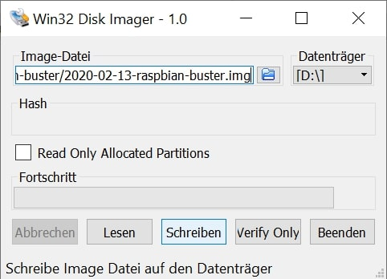
    </p>

	* Alternatively, follow [the official Raspian-guide](https://www.raspberrypi.org/documentation/installation/installing-images/README.md) or if you bought the Raspberry SD card directly just skip this step.

3. **Insert SD-card** into RasPi and **start the device**.
 * You can put the Raspi+display into the case now or any time later.
 * The RasPi doesn't have a power switch - it will turn on when you plug it to the electrical socket.
 * You should see a red LED light up on the Raspberry Pi, which indicates that Raspberry Pi is connected to power. As it starts up (this is also called booting), you will see raspberries appear in the top left-hand corner of your screen.
 * Your display might be turned upside down. This will be handled soon. The desktop appears.
 * The desktop might not look exactly like this, it depends on the operation OS of the RasPi
 <p align="center">
 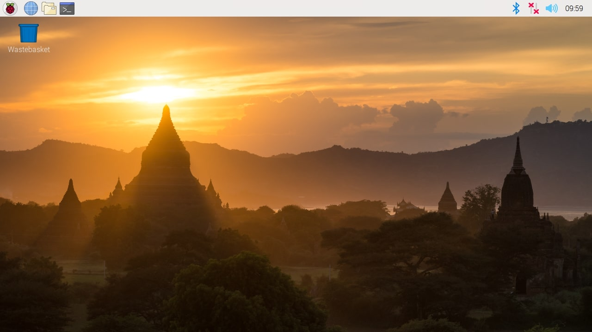
 </p>

 Firstly, Welcome to Raspberry Pi application will pop up and guide you through the initial setup:
    * Setup country info (e.g. Germany->German->Berlin or according to where you are) and select "Use English language". Make sure, that your keyboard-input works as intended - the default setting might be US keyboard. Please find further information on how to setup RasPi on the [Official Homepage](https://www.raspberrypi.org/documentation/).
		<p align="center">
	  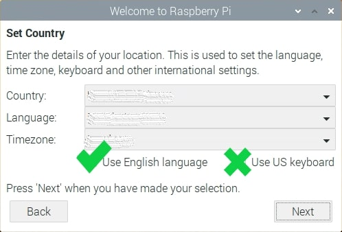
	  </p>
    * Skip changing the account password by clicking 'Next' We will anyways provide a routine for changing the username and password as well as locking the root-access.
    * Fix the screen scaling if necessary and connect to a local WiFi (which has internet connection) and allow your RasPi to check for the newest updates. If it doesn't update, don't worry, it will be taken care of.

4. :feet: Your way to communicate with the RasPi will be the terminal, where you insert commands (and press Enter to execute them).
	* Open the terminal from the task bar (Left to right: Raspberry (Start) - Browser - File Explorer - Terminal)
	* Open this GitHub page in the browser on the RasPi - you will need to copy the commands from here into the terminal
	* Attention! Raspberry Pi's operation system is similar to Linux in many aspects and if you're a Windows user you should remember this:
	 * `Ctrl+C` in terminal will end the process that is currently running
	 * To transfer the command from the browser into the terminal use `Ctrl+C` in the browser to copy the code. To paste it onto the terminal use `Shift+Crtl+C` or `Shift+Insert` (see what works for you)
	 * To transfer something from the terminal into the browser (for example when searching for an error message) use `Shift+Crtl+C` or `Shift+Del` in the terminal to copy the message. To paste it into the browser, use the standard Ctrl+V
	 * The '$' symbol  in all the following codes marks a line and is not meant to be copied ;-)

5. **Back to updates** - If updates are impossible due to: *Could not sync time - unable to check for updates* error, you can fix the date and time manually. You now have two options:
	 * Recommended: You can either download our fix_date script from the [SCRIPTS section](./SCRIPTS) for ease of input (especially if you will have to fix the time more often...) and enter the date as suggested from commandline
    * Your RasPi should be now connected to the internet and therefore you should be able to get the fix_date script by using the following commands
    ```
    $ cd ~/Downloads
    $ wget https://raw.githubusercontent.com/bionanoimaging/UC2-Software-GIT/master/GUI/RASPBERRY_PI/SCRIPTS/FIX_date/date_manfix.py
    $ python3 Downloads/date_manfix.py
    ```
    Then follow the instructions in the terminal
	  * :feet: In case the previous steps don't work, on a computer go to the [raw code date_manfix.py](https://raw.githubusercontent.com/bionanoimaging/UC2-Software-GIT/master/GUI/RASPBERRY_PI/SCRIPTS/FIX_date/date_manfix.py) and save it as a .py, then transfer it to the Downloads directory of the RasPi
	* Open a terminal and type:
        ```
        $ python3 Downloads/date_manfix.py
        ```
        and follow the instructions in the terminal.
	 * **OR** fix the entry directly by opening a terminal and enter your actual time like e.g.:
        ```
        $ sudo date -s "Mon Mar 16 18:00:00 CET 2020"
        ```
    changing the date.

 * Now open a terminal and try to invoke the update manually by typing:
       ```
      $ sudo apt-get update && sudo apt-get upgrade -y
      $ sudo reboot now
      ```   
		If the RasPi still didn't update, just continue. It will be solved later.
6. (OPTIONAL) **Rotate the screen** If e.g. 7" Touch-Screen is used: rotating the Screen might be necessary. In a Terminal enter (for 2x90° rotation)
        ```
        $ sudo sh -c "echo 'lcd_rotate=2' >> /boot/config.txt"
        $ sudo reboot now
        ```
      Note: This step could be done in advance on your PC/Laptop already.
7. **Activate interfaces** and configure device. In a terminal enter:
    ```
    $ sudo raspi-config
    ```     
    go to `Interfacing Options` and enable:
    *   [Camera](https://www.raspberrypi.org/documentation/configuration/camera.md)
    *   [SSH](https://www.raspberrypi.org/documentation/remote-access/ssh/)
    *   (OPTIONAL) the [I2C](https://learn.adafruit.com/adafruits-raspberry-pi-lesson-4-gpio-setup/configuring-i2c)-interface.

    Finish and reboot by typing  
    ```
    $ sudo reboot now
    ```   
    (We'll be doing this a lot.)
8. **Change username and disable root.** First, give a password to the root-account. Open a terminal and type:
    ```
    $ sudo passwd root
    ```
 * Enter a suitable password.
 * Then, reboot into a shell so that no process of your right now active user **pi** is already running after boot. To do so
    * open again the Raspi-Configuration interface (`sudo raspi-config`)
	* go to `boot options` -> `Desktop/CLI` (Raspi4) -> `Console` (without(!) Autologin) AND `Desktop` (without(!) Autologin)
	* click on `Finish` and agree to reboot.

 * Now, **login as `root`** with you newly set password, open the terminal and type.  
    **Note:** Replace "your-uc2name" including the quatotaion marks to your favored username (example: your chosen username is for example MyUC2 so you type `usermod -l MyUC2 pi` and so on).
```
    $ usermod -l "your-uc2name" pi
    $ usermod -m -d /home/"your-uc2name" "your-uc2name"
    $ passwd "your-uc2name"
    $ logout
```
 * Now, **login as your new "your-uc2name"-User** using the previously set password and, after connecting to internet (which should happen automatically), type into the terminal:
```
    $ sudo apt-get update
```
Now the updates should actually go through (if it didn't before) and everything is on track. Next, lock the root-account for safety using the following lines:
```
    $ sudo passwd -l root
    $ sudo apt-get upgrade
    $ sudo raspi-config
```
And (as before) go to `boot options` -> `Desktop/CLI` (Raspi4) -> now enabling `Desktop Autologin` to boot into your new account directly. Then reboot (`sudo reboot now`).


9. **Change RasPi-name and hostname**:
    * In `sudo nano /etc/hosts` change the last entry `127.0.0.1 raspberrypi` (or 127.0.1.1) to  e.g. `127.0.0.1 UC2Pal01` (or 127.0.1.1 UC2Pal01), if it is your first raspberry in your group of setups. Save and exit (via `Ctrl+X` -> `y` and then hit enter). DO NOT change anything above the mentioned line!
    * Then `sudo nano /etc/hostname` and change the name to the same name as used above. Save, exit (`Ctrl+X` -> `y` -> Enter) and reboot (`sudo reboot now`).

## Setup UC2env for our GUI

For easy Python-environment handling, you need to install the [Berryconda](https://github.com/jjhelmus/berryconda) derivate of [Anaconda](https://www.anaconda.com/). We prepared some convenient scripts that you can download from our [SCRIPTS-section](SCRIPTS/SETUP_UC2env) to install Berryconda, setup a UC2env for development and activate it as standard. Just follow this tutorial and you'll be told all the right steps in the right time.

### Disclaimer
By using this install script you **agree** to the following [license agreement](https://github.com/jjhelmus/berryconda/blob/master/LICENSE.txt) available in the following [Berryconda repository](https://github.com/jjhelmus/berryconda).


### Installing
* **Download all files** of the [SCRIPTS-section](SCRIPTS/SETUP_UC2env)
For downloading the files, first create two new directories:
    ```
    $ mkdir -p ~/UC2/SCRIPTS
    $ cd ~/UC2/SCRIPTS
    ```
    and then download the Script files there using:
    ```
    $ wget https://raw.githubusercontent.com/bionanoimaging/UC2-Software-GIT/master/GUI/RASPBERRY_PI/SCRIPTS/SETUP_UC2env/00-UC2_Prerequisites.sh
    $ wget https://raw.githubusercontent.com/bionanoimaging/UC2-Software-GIT/master/GUI/RASPBERRY_PI/SCRIPTS/SETUP_UC2env/01-UC2_Berryconda.sh
    $ wget https://raw.githubusercontent.com/bionanoimaging/UC2-Software-GIT/master/GUI/RASPBERRY_PI/SCRIPTS/SETUP_UC2env/02-UC2_CreateEnvironment.sh
    ```
* After downloading all 3 files, make the files runable via:
    ```
    $ chmod +x 00-UC2_Prerequisites.sh 01-UC2_Berryconda.sh 02-UC2_CreateEnvironment.sh

    ```
* **Run** the first file 01-UC2_Berryconda.sh by typing:
    ```
    $ ./01-UC2_Berryconda.sh
    ```
    This command installs Berryconda and it should give you this:
    <p align="center">
        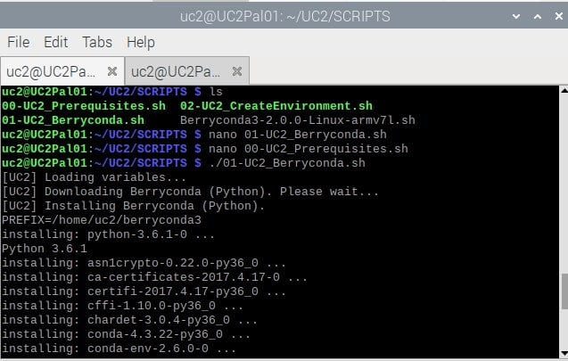
				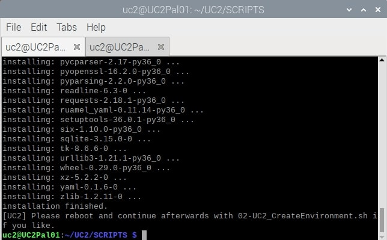
    </p>

    Reboot (`sudo reboot now`) as requested.
* **Run** the second file	02-UC2_CreateEnvironment.sh by typing:
```
$ cd ~/UC2/SCRIPTS
$ ./02-UC2_CreateEnvironment.sh
```
	This should give you:
    <p align="center">
        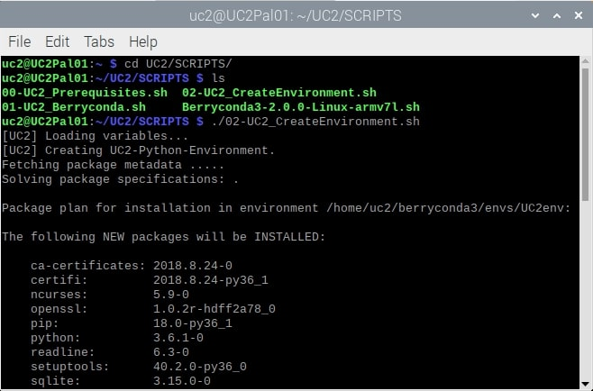
        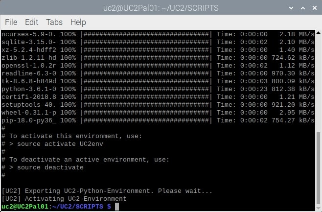
    </p>     

* Check whether the installation was successful via
    ```
    $ which conda
    $ which python
    $ source activate UC2env
    $ which python
    $ python
    $ exit()
    ```
    which should give you this as a result:
    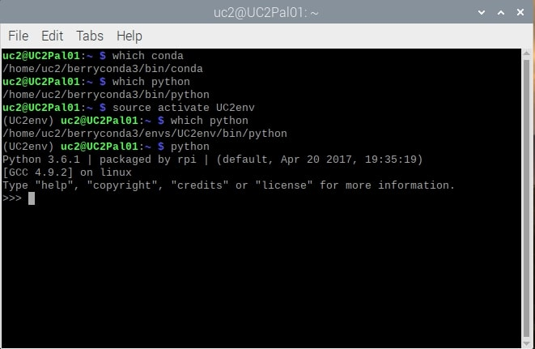
    </p>
    By this you make sure that the environment and proper python version (here: 3.6.1) are installed.

## Installing Kivy
* **Activate** the conda *UC2env* environment
    ```
    $ source activate UC2env
    ```
* **Install Kivy-dependencies** as described in 1. and 2. bullet-point of the [official Kivy-homepage](https://kivy.org/doc/stable/installation/installation-rpi.html) as a preparation to use our GUI.  
We've put all the necessary steps here, so there's no need for you to jump to the Kivy page, just stick to this tutorial.   
:feet: Attention! Lines 2-7 are actually a single line of code - copy, paste and execute it as such!
    ```
    $ sudo apt update
    $ sudo apt install libsdl2-dev libsdl2-image-dev libsdl2-mixer-dev libsdl2-ttf-dev \
      pkg-config libgl1-mesa-dev libgles2-mesa-dev \
      python-setuptools libgstreamer1.0-dev git-core \
      gstreamer1.0-plugins-{bad,base,good,ugly} \
      gstreamer1.0-{omx,alsa} python-dev libmtdev-dev \
      xclip xsel libjpeg-dev
    $ python -m pip install --upgrade pip setuptools
    $ python -m pip install --upgrade Cython==0.29.10 pillow   
    ```
     <p align="center">
    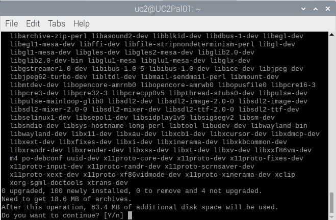
    </p>

	When installing something, the RasPi tells you how much disk space will be used and asks for confirmation to proceed. Type `Y` and Enter.  
    The Python-package Cython will be freshly compiled on your system and might need a while (~5min). If you have a Raspi3 (or older), make sure that you [enhance your RAM before](https://raspberrypi.stackexchange.com/questions/8308/how-to-install-latest-scipy-version-on-raspberry-pi) (the same is true for e.g. Numpy, Scipy etc on RasPi).

* Note: If you get the warning: *The scripts cygdb, cython and cyhonie are installed in '/home/yourUC2name/.local/bin' which is not on PATH*
    <p align="center">
    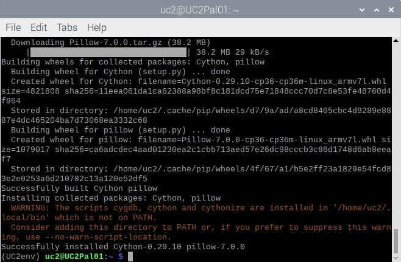
    </p>
    then try the following:

    ```
    $ echo -e '#Adding Cython binary path to PATH' >> ~/.bashrc
    $ echo -e 'export PATH="/home/yourUC2name/.local/bin:$PATH"' >> ~/.bashrc
    $ source ~/.bashrc
    $ source activate UC2env
    ```
* **Build Kivy:** We suggest you to build Kivy on your system to get the best performance with touch screen and Window provider even from within Berryconda environment. Therefore, in the terminal, run:
    ```
    $ cd ~/UC2
    $ git clone https://github.com/kivy/kivy
    $ cd kivy
    $ python -m pip install .
    ```
    The installation of kivy again will take a while (~15min, MEM<=500MB), so lean back and enjoy a coffee. But don't forget to confirm the installation by `Y`+Enter ;-)
* **Setup the device** Once Kivy is finished, configure the touch screen of RasPi (if installed) as valid input method. Hence, in the terminal run
    ```
    $ nano ~/.kivy/config.ini
    ```
    and search (`Ctrl+W`) for `[input]` and add the following two lines
    ```
    $ mtdev_%(name)s = probesysfs,provider=mtdev
    $ hid_%(name)s = probesysfs,provider=hidinput
    ```
    <p align="center">
    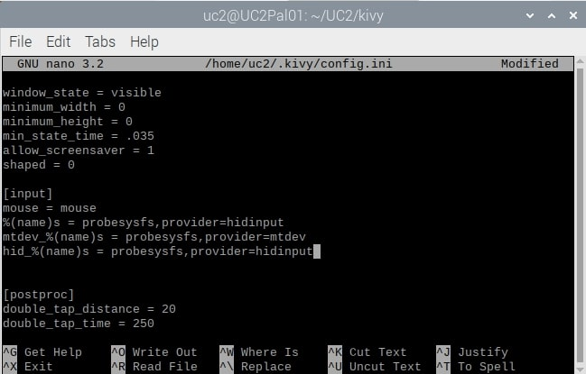
    </p>

    Then (`Ctrl+X` `y` Enter) to save the changes.

* Hint: for any further issues configuring kivy with RasPi-screen, check out [this description](https://github.com/mrichardson23/rpi-kivy-screen).

**Congratulations!** KIVY is now prepared to run properly on your device.

## Running the MQTT server
If you decided to use your system with the I2C-protocoll in a wired state (with Arduino), you can skip this part. If you decided to use the MQTT (WiFi-based) service to connect to your Micro-Controller (ESP32 -> for hardware like LED, motor etc) then you need to install the mosquitto server. For now, we will only setup a non-secured connection as we assume, that your WiFi is anyways local and non-public as well as uses WPA2. In a terminal, run:
```
$   sudo apt-get install mosquitto mosquitto-clients
```
The service will automatically start and is running. Nice!

## Preparing and running our GUI
* If you for some reason didn't connect the camera yet, do it now. Switch off the RasPi, connect the camera cable a switch it on again.
* First, let's make sure that the RasPi cam is properly connected and available.  In a terminal, run:
    ```
    $ raspistill -k
    ```
    and close the camera stream with `Ctrl+C`. If the camera is not starting or you encounter some errors, try to make it work before continuing the guide. You can check [this troubleshooting guide](https://windowsreport.com/raspberry-pi-camera-not-detected/) or copy the error message and simply google it ;-)
* Now, let's prepare our UC2env by installing the necessary packages:
    ```
    $ source activate UC2env
    $ conda install numpy matplotlib pyserial
    $ python -m pip install unipath ruamel.yaml pyyaml imageio safe-cast picamera smbus paho.mqtt
    $ cd ~/UC2/
    $ git clone https://github.com/bionanoimaging/UC2-Software-GIT.git
    $ mkdir UC2-GUI
    $ cp -r ./UC2-Software-GIT/GUI/RASPBERRY_PI/RASPIapp_py3/* ./UC2-GUI
    ```
    As you might have noticed, with the last command you had to download way too many files. We are still searching for a good script to download only the necessary folders from our archive for particular tasks. Contact us, if you have any ideas. :-)
* Now, we need to make sure that the right setup-ID is assigned to the RasPi. Therefore, in a terminal open:
    ```
    $ cd UC2-GUI
    $ nano config/communication.yaml
    ```
    Search for the (`Ctr+W`) `mqtt setup` and change it to e.g. `S001`. Then (`Ctrl+X` `y` Enter) and save the changes.  
    **This is very important!** All the hardware parts will recognize the RasPi by its setup number. Make sure to use the same number for the microcontrollers you'll be connecting to this RasPi.
    <p align="center">
    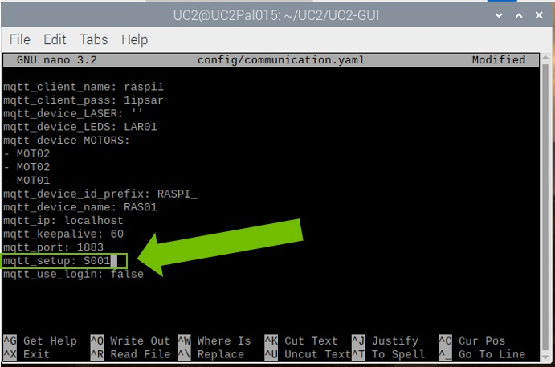
    </p>
* **Run the GUI**, by running:
    ```
    $ python main.py
    ```
    It should start without any errors, but maybe it is overscaled on the first start. Just restart it and it should work.
* Quick test: Press "Start Preview" (using the touchscreen or the mousepad) on the top to start your camera stream. Press "CUS" on the left to get the LED-array-manipulation window and by pressing the blocks that represent the LEDs, create a smiley face.
    <p align="center">
    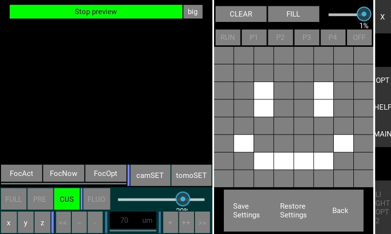
    </p>   
* **Congratulations! You made it! Your RasPi is now smiling at you :-)**

## Useful steps for user-friendliness
If you now switch off the RasPi and start it again, you need to open the  GUI from the terminal by typing:
```
$ source activate UC2env
$ cd ~/UC2/UC2-GUI
$ python main.py
```
which is not very convenient, so follow the next steps to make it easier to run the GUI.
### Easy Startup for the GUI
Let's create a simple startup-script that we can directly run from the Desktop. Open a terminal, go to your Desktop, create a new file:
```
$ cd ~/Desktop/
$ touch UC2_startGUI.sh
$ nano UC2_startGUI.sh
```
Then insert the following code and replace "your-uc2name" with your chosen username. Make sure that the path (here: ~/UC2/UC2-GUI) is the same as where you stored your GUI-files.
```
#!/bin/bash
export PATH="/home/your-uc2name/berryconda3/bin:$PATH"
source activate UC2env
cd ~/UC2/UC2-GUI/
python main.py
```
exit and save (`Ctrl+X` `y` Enter). Finally,  make the file executable:
```
chmod +x ./UC2_startGUI.sh
```

Voila. Now: double click on the file and choose 'Execute in Terminal'.
### Easy Startup for the fix_date code
If you have your setup at home, it should be enough to set the date and time in the beginning. But if you're logged into a university or institute WiFi (like us), the Raspi might have troubles to keep the date correct. Therefore,you might need to set the time manually from time to time, especially when doing measurements, so that they're saved with the correct date.  
Firstly, move the date_manfix.py file from the Downloads directory to the other UC2 scripts. Open the terminal and type:
```
cd ~/Downloads/
mv date_manfix.py /home/UC2/UC2/SCRIPTS/
```
Then, the steps are almost the same as for creating the shortcut to the GUI, just make sure to make the files correctly:
```
$ cd ~/Desktop/
$ touch fix_date.sh
$ nano fix_date.sh
```
Insert the following code:
```
#!/bin/bash
export PATH="/home/your-uc2name/berryconda3/bin:$PATH"
source activate UC2env
cd ~/UC2/SCRIPTS/
python date_manfix.py
```
Now you have both shortcuts on the Desktop. You simply open them by double-click and 'Execute in Terminal'.

## Easy Startup for the GUI
For further ease, let's create a simple startup-script that we can directly run from the Desktop. Open a terminal, go to your Desktop, create a new file as follows:
```
$ cd ~/Desktop/
$ touch UC2_startGUI.sh
$ nano UC2_startGUI.sh
```
Then insert the necsesary code and replace "your-uc2name" with your chosen username. Make sure that the path (here: ~/UC2/UC2-GUI) is the same as where you stored your GUI-files.
```
#!/bin/bash
export PATH="/home/your-uc2name/berryconda3/bin:$PATH"
source activate UC2env
cd ~/UC2/UC2-GUI/
python main.py
```
exit and save. Finally,  make the file executeable:
```
chmod +x ./UC2_startGUI.sh
```

Voila. Now: double klick on the file.

## Connecting the Microcontrollers
We reached the final preparation step. Depending on whether you chose to use ESP32 + MQTT or Arduino + I2C - connection your path from here on splits.
* [The ESP32 + MQTT PATH](../../HARDWARE_CONTROL/ESP32/README.md)
* [The ARDUINO + I2C PATH](../../HARDWARE_CONTROL/ARDUINO/README.md)

Once the devices are setup and powered (running), restart your GUI on the RASPI. To control e.g. the LED-array, on the left click "CUS" and click on the different fields on the right, thereby (de-) activating the different LED elements.

## How to work with the GUI
Coming soon. :)

## Viewing images or copying them from the device
Finally, you took some images and want to process them. You now have multiple options. You can:
* View them directly using the typical File-Browser installed on your RasPi
* copy the files on a USB-drive
* access the Raspi using sFTP connection
* so many options more, but let's stick to the ones above :)
We will briefly describe how to access your device using the sFTP-interface. In our case, we suggest the free tool [FileZilla](https://filezilla-project.org/download.php). Download and install it onto your PC.

...further explanation will come soon.


# Optional Steps from now
## Sharing the finished (prepared) Image
For sharing your prepared SDcard (e.g. to save a lot of time setting up more than 1 RasPi) Shrinking the size of the main partition (/dev/root) to make swapping between SDcards of different size (even if they are claiming to be 16GB the final size might differ by 1-500mb) or online easier is recommended. For our main-partition this cannot be done in-place (=while Raspbian is running), because the partition to be resized has to be unmounted. Hence, we suppose to using a boot media (e.g. USB-drive) with GPARTED on it.
1. download [TUXBOOT](https://tuxboot.org/download/)
2. Create Bootable USB-drive by choosing GPARTED
3. Restart laptop, go to BIOS and boot from USB-drive
4. After LINUX came up: Mount SD-card and resize /dev/root partition to desired size (e.g. 6GB)
5. Test SD-card with RasPi


# Acknowledgements
Thanks go to:
* https://github.com/jjhelmus/berryconda for making Python 3.6 easily available for RaspberryPi.
* X. Uwurukundu and N. Schramma for helping improve this guide.
