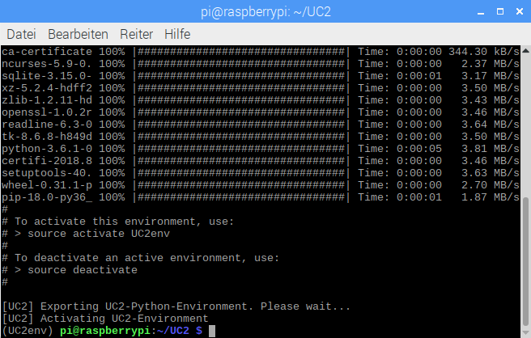

## Disclaimer
By using this install script you agree to the following [license agreement](https://github.com/jjhelmus/berryconda/blob/master/LICENSE.txt) available in the following [repository](https://github.com/jjhelmus/berryconda).


## Installing
* Download all files of this directory
* Run 01-UC2_Prerequisites.sh by typing into your terminal:
```
$ ./01-UC2_Prerequisites.sh
```
* wait until installation completes
* close current and open *new* terminal window
* check whether installation was successful by typing into new opened terminal window:
```
$ which conda
```
* you should see a directory as output
* if you get no output at all then something went wrong
* if everything's fine proceed by typing
```
$ source 02-UC2_Berryconda.sh
```
* your final terminal output should look like this (last line):



## Acknowledgements
Thanks to https://github.com/jjhelmus/berryconda for making Python 3.6 easily available for RaspberryPi.
