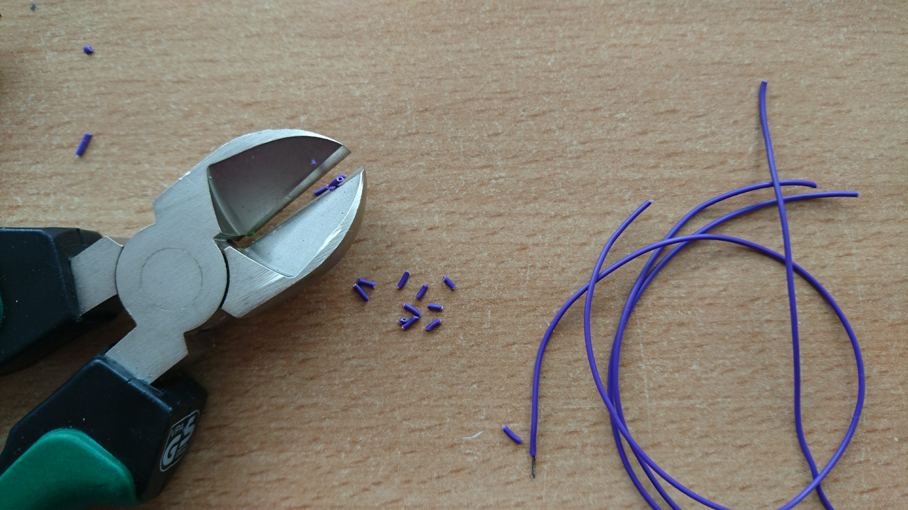

# Z-STAGE and Sample-STAGE (ESP32; MQTT)

Z-stage and Sample stage are the very same in terms of electronics - you just mount the motors on different 3Dprinted parts.

The electronics part of this project is quite simple. We only need a motor which drives the mount of the microscope objective lens (for Z-stage) and the sample stage. We rely on the well-known 28BYJ-48 Stepper motor which operates at 5V and has up to 4096 steps per revolution. It comes with a motor driver ([TI ULN2003](http://www.ti.com/lit/ds/symlink/uln2003a.pdf)) which converts a 4-wire input signal into the 5-wire output signal necessary for the bipolar stepper motor. Further resources can be found [here](http://www.hobby-werkstatt-blog.de/arduino/357-schrittmotor-28byj48-am-arduino.php).

In order to let the motor spin in both directions with different speed, we need to generate a signal which has a specific order of high/low pulses for each channel. Therefore we use a microcontroller (ESP32 DEV) which can conveniently be programmed in the Arduino IDE (see software section).

## Wiring
We need to connect each input-channel of the motor-controller board to an output of the ESP microcontroller. Additionally, we need to connect the power of both  controllers (+/- to +5V/GND respectively). In general we could use any of the output pins of the ESP32, but we typically use the following:


```
Motor  = 25, 26, 27, 14
```

They connect to the IN1, IN2, IN3, IN4 of the motor controller respectively, as indicated below:

<p align="center">

<br> THIS SCHEME NEEDS AN UPDATE!!!
</p>

## Soldering

Have a look in the [TUTORIALS](../TUTORIALS) for some soldering guidelines, if you're not professional in it. Then follow these steps:

* Take 10 wires and cut them to around 100 mm
* Remove the isolation of each wire at both sides
* Add some lead to both sides using the solder iron
* Solder the wires to the electronic parts


    The images in this section need an update!

If everything went correct, the entire circuit should look like the lower photograph.

1. Remove the isolation of the wires


1. Add some lead to the tips of the short wires and solder them to both sides of the ESP and ULN2003.


1. Finish the setup using and flash the example program to the ESP so that both motors move back-and-forth


## Code
The code can be found in the [Software GIT](https://github.com/bionanoimaging/UC2-Software-GIT).

The code needs to flashed using the Arduino IDE with the ESP32 library. Further information can be found in [TUTORIALS](../../TUTORIALS)

## Safety
Make sure to release the motor when not using in, otherwise it can get quiet hot!
