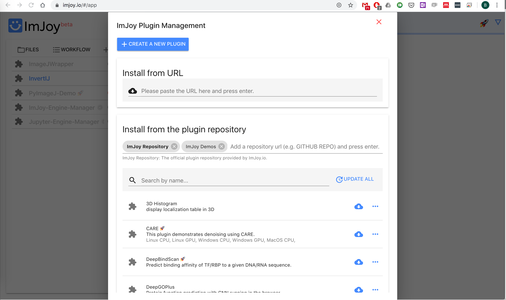
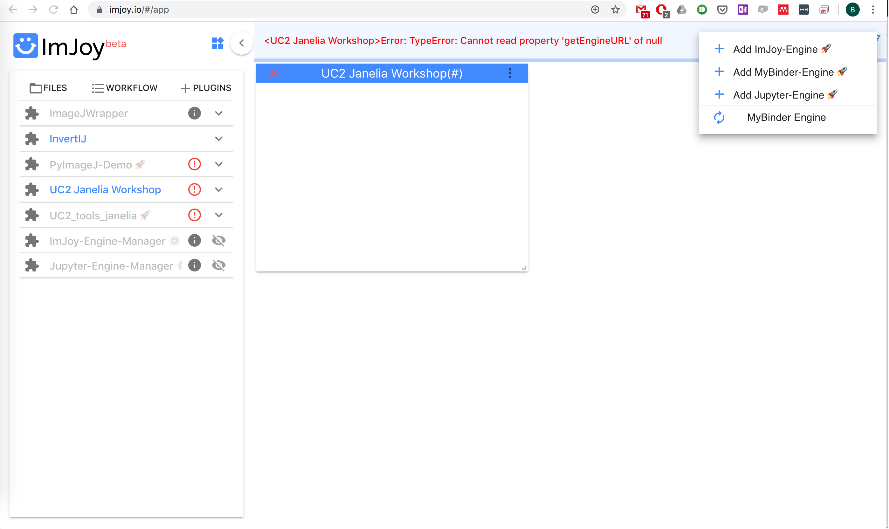

# Experiment 5 - Intro to Image Processing with ImJoy
Simple example on how to use ImJoy

This tutorial gives you an idea on how to operate a simple image processing task with your cellphone as a camera for a microscope and [ImJoy](https://imjoy.io) as the cloud-based software.

We provide a sample script in our [UC2 ImJoy Repository](https://github.com/bionanoimaging/UC2-ImJoy-Plugins) which you can fork and modify.
The file of interest is called ```UC2_tools_janelia.imjoy.html```


During this work you will learn how to load an image through the web-interface and perform a basic edge-detection task which gets displayed in the browser.


## Start the ImJoy Server (only for Admin)

After installing ImJoy Server following [this tutorial](https://imjoy.io) a https-tunnel has to be established using telebit. Follow the steps mentioned [here](https://telebit.cloud/). Setup an account and start the server using:

```
~/telebit http 9527

telebit restart - stops connection
```

It forwards the port **9527** which is now visible to the public (!).


Go to [https://imjoy.io](https://imjoy.io) and start ImJoy

<p align="center">

</p>

Hit the "Start ImJoy" button and click "+ Plugins" on the left hand-side

<p align="center">

</p>

add the UC2-repo: [https://github.com/bionanoimaging/UC2-ImJoy-Plugins](https://github.com/bionanoimaging/UC2-ImJoy-Plugins) in "Install from the plugin repository" and hit enter:

<p align="center">

</p>

Click on the cloud-symbol next to "UC2 Janelia Workshop" to install the plugin.

We need to add the Plugin engine for the computationally expensive algorithms:

<p align="center">

</p>

Click on "Add new Plugin engine(#)" and add this:
[https://honest-otter-XX.telebit.io/](https://honest-otter-98.telebit.io/) and the Token: ```bf50b0cd-5123-46a6-9984-a6b8860fc7c5```

Now you can execute all plugins either on the cellphone or the laptop:


## Tutorial to install the plugins

1.) Go to:

•	[https://imjoy.io/#/app](https://imjoy.io/#/app)

2.) Add Computing Engine using the rocket-symbol; select “another Computer” and enter the URL (replace XX with given my UC2):

•	[https://honest-otter-XX.telebit.io/](https://honest-otter-98.telebit.io/)

3.) Enter Token:

•	bf50b0cd-5123-46a6-9984-a6b8860fc7c5

4.) Add UC2-ImJoy Plugin Repository (paste and hit enter)
•	[https://github.com/bionanoimaging/UC2-ImJoy-Plugins](https://github.com/bionanoimaging/UC2-ImJoy-Plugins)

5.) Select „UC2 Janelia Workshop“ by clicking on the cloud to install it

6.) In the side-bar select “UC2 Janelia Workshop”

6.) Select any image and upload it

7.) Wait and keep your fingers pressed
###


## Code

### GUI

The following code can be found in the GUI-file: ```UC2_GUI_UploadDemo.imjoy```

**JSON**
This handles the GUI settings for the ImJOY backend and the libraries necessary to deal with loading data and save it to the local server:

```
<config lang="json">
{
  "name": "UC2 Upload Demo",
  "type": "window",
  "tags": [],
  "ui": "",
  "version": "0.1.0",
  "cover": "",
  "description": "[This describes how to upload and process an image through the GUI.]",
  "icon": "extension",
  "inputs": null,
  "outputs": null,
  "api_version": "0.1.2",
  "env": "",
  "permissions": [],
  "requirements": [
    "https://unpkg.com/axios/dist/axios.min.js",
    "https://unpkg.com/spectre.css/dist/spectre.min.css",
    "https://unpkg.com/spectre.css/dist/spectre-exp.min.css",
    "https://unpkg.com/spectre.css/dist/spectre-icons.min.css"],
  "dependencies": ["bionanoimaging/UC2-ImJoy-GIT:UC2_nip_demo"],
  "defaults": {"w": 20, "h": 10}
}
</config>
```


**JAVASCRIPT**

This handles the loading of the data, sending it to the processor and later visualization of the image:

```
<script lang="javascript">

class ImJoyPlugin {
  async setup() {
    api.log('initialized')
    // asuming you have a python plugin named "MinimalNIP", with a function named "getEngineURL" which returns api.ENGINE_URL, and another function "setParam1".
    const plugin = await api.getPlugin("UC2_nip_demo")
    const engine_url = await plugin.getEngineURL() // 'https://imjoy.pasteur.cloud'
    const fileInput = document.getElementById("file-input");
    // If user selected a new file or take a new photo, load it and do prediction.
    window.process = async ()=>{
      const file = fileInput.files[0]
      const upload_url = await api.requestUploadUrl({path: './test_.png', overwrite: true, engine: engine_url})
      const bodyFormData = new FormData();
      bodyFormData.append(
        "file",
        new Blob([file], {
          type: "application/octet-stream",
        })
      );
      await api.showMessage("Uploading a file to " + upload_url);
      await axios({
        method: "post",
        url: upload_url,
        data: bodyFormData,
        headers: { "Content-Type": "multipart/form-data" },
      })
      const param1 = document.getElementById("param1");
      await plugin.setParam1(param1.value)
      await plugin.process()
    }
  }

  async run(ctx) {

  }
}
```

### PROCESSING


The following code can be found in the processing file ```UC2_tools_janelia.imjoy.html```
**JSON**
This is the header managing the dependencies of the code. It automatically installs all the library in the miniconda environment to be able to use the Python code later:

```
<config lang="json">
{
    "name": "UC2_tools_janelia",
    "type": "native-python",
    "version": "0.1.0",
    "description": "[This is the backend to process any data which is coming from the cellphone.]",
    "tags": [],
    "ui": "",
    "cover": "",
    "inputs": null,
    "outputs": null,
    "flags": [],
    "icon": "extension",
    "api_version": "0.1.6",
    "env": "",
    "permissions": [],
    "requirements": ["numpy", "matplotlib", "pillow", "scikit-image", "scipy", "requests"],
    "dependencies": []
}
</config>
```


**PYTHON**

This code receives an image coming from a HTML-based Image Loader and process it e.g. edge detection. The final result gets sent back to the HTML GUI:

```
<script lang="python">
from imjoy import api
import numpy as np
from scipy import ndimage as ndi
from skimage.morphology import watershed
from skimage.feature import peak_local_max
from skimage import color
from skimage.filters import threshold_otsu
from skimage import morphology
from skimage.morphology import disk
from scipy import ndimage as ndi
from skimage import feature, measure
from PIL import Image
import base64

import matplotlib as mpl
mpl.use('Agg')
from matplotlib import pyplot as plt

plt.ioff()

class ImJoyPlugin():

    def setup(self):
        self.window = None
        api.log('initialized')

    def getEngineURL(self):
        return api.ENGINE_URL

    def setParam1(self, param):
        self.param1 = param

    def setURL(self, url):
        self.url = url

    async def process(self):
        await api.alert('processing with param1='+ str(self.param1))

        # Taken from http://opensciencecafe.org/2016/01/counting-change-image-analysis-python/
        # await api.alert('Processing the image')

        # load the image which was loaded through the GUI
        # await api.alert('Loading image from: '+self.url)
        myimage = np.array(Image.open(self.url)) #myimage = plt.imread()
        myimage_gray = color.rgb2gray(myimage)

        # Adaptive Thresholding the image
        thresh = threshold_otsu(myimage_gray, nbins=5)
        thresh_im = myimage_gray > thresh

        # Cleaning up the mask
        no_small = morphology.remove_small_objects(thresh_im, min_size=150)
        neurons = morphology.binary_closing(no_small,disk(3))

        # Masking
        myimage[neurons==False] = 0
        myimage_gray[neurons==False] = 0

        # Watershed Segmentation
        distance_im = ndi.distance_transform_edt(neurons)

        peaks_im = feature.peak_local_max(distance_im, indices=False)

        markers_im = measure.label(peaks_im)
        labelled_neurons = morphology.watershed(-distance_im, markers_im, mask=neurons)
        num_neurons = len(np.unique(labelled_neurons))-1  # subtract 1 b/c background is labelled 0
        await api.alert('number of neurons: %i' % num_neurons)

        # Plot the result and save as png in order to display it
        fig1, ax = plt.subplots(num='Labelled Neurons')
        plt.imshow(labelled_neurons,cmap='jet')
        name_plot = 'MyNeurons.png'
        plt.savefig(name_plot,dpi=300)
        with open(name_plot, 'rb') as f:
            data = f.read()
            result = base64.b64encode(data).decode('ascii')
            imgurl = 'data:image/png;base64,' + result
            data = {"src": imgurl}
            data_plot = {
                'name':'Plot charts: show png',
                'type':'imjoy/image',
                'w':16, 'h':20,
                'data':data}
        ## Check if window was defined
        if self.window is None:
            self.window = await api.createWindow(data_plot)
            print(f'Window created')
        else:
            print(f'Update window.')
            try:
                await self.window.run(data=data)
            except:
                self.window = await api.createWindow(data_plot)
                print(f'Could not print to old window. New window created.')
        await api.showMessage('done!')


    def imshow_overlay(im, mask, alpha=0.5, color='red', **kwargs):
        """Show semi-transparent red mask over an image"""
        mask = mask > 0
        mask = np.ma.masked_where(~mask, mask)        
        plt.imshow(im, **kwargs)
        plt.imshow(mask, alpha=alpha, cmap=ListedColormap([color]))

    def my_imshow(im, title=None, **kwargs):
        if 'cmap' not in kwargs:
            kwargs['cmap'] = 'gray'
        plt.figure()
        plt.imshow(im, interpolation='none', **kwargs)
        if title:
            plt.title(title)
        plt.axis('off')

    def run(self, ctx):
        print('Hello World')

api.export(ImJoyPlugin())
</script>

```


## TASKS

Exhange the part of ```# Watershed Segmentation```with an edge detection á la ```opencv``` canny-edge detection.
